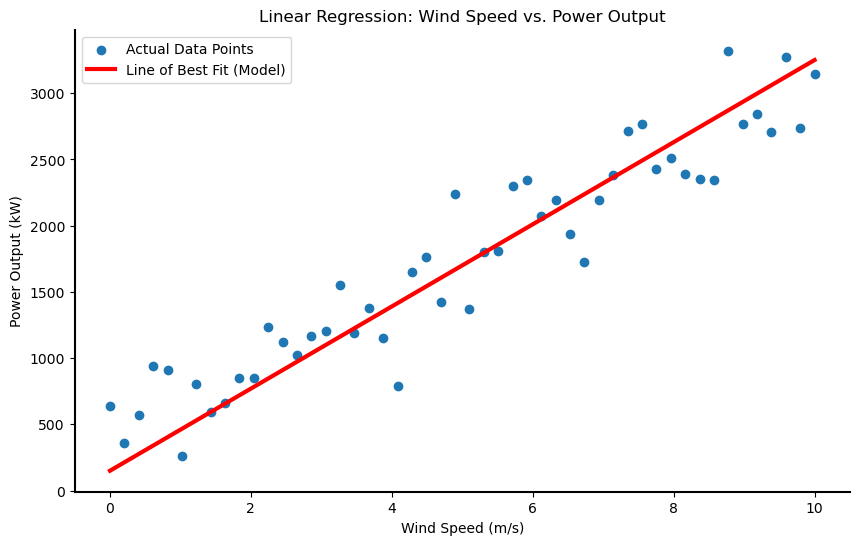

# Linear Algebra Applied - I

Linear algebra is arguably the most essential field of mathematics for machine learning. Its applications are vast and foundational to how many algorithms work. This course will use machine learning examples to provide context for the mathematical concepts you'll be learning.

---

## Linear Regression: A Practical Example

One of the most common machine learning models, **linear regression**, provides a perfect entry point into systems of linear equations.

Linear regression is a **supervised machine learning** technique. This means we start with a dataset containing known inputs (features) and a corresponding output (target). The goal is to discover the underlying relationship between them.

### Single-Feature Linear Regression

Imagine we want to predict the electrical power output of a wind turbine based on a single feature: wind speed.

* **x-axis**: Wind Speed (our input feature)
* **y-axis**: Power Output (our target)

If we plot our collected data points, we might see a clear pattern. The objective of linear regression is to find the **line of best fit** that models this data:

The equation for the line above is the familiar:

$$ y = mx + b $$

In machine learning, this is often written as:

$$ y = wx + b $$

* `y`: The predicted output (Power Output)
* `x`: The input feature (Wind Speed)
* `w`: The **weight**, a constant that scales the input feature.
* `b`: The **bias**, a constant that shifts the line up or down.

The goal is to find the optimal values for the weight (`w`) and bias (`b`) that make the line fit the data as closely as possible. Let's visualize this:

### Multi-Feature Linear Regression

In most real-world scenarios, you'll use more than one feature to make a prediction. Let's add **temperature** to our wind turbine model. The equation now needs a new weight for the new feature:

$` y = w_1(\text{wind\_speed}) + w_2(\text{temperature}) + b `$

With two features, our model is no longer a line in a 2D plane. It's now a **plane** in a 3D space. We can extend this idea to any number of features ($n$), such as pressure, humidity, etc. The generalized equation for $n$ features becomes:

$$ y = w_1x_1 + w_2x_2 + \dots + w_nx_n + b $$

Here, $x_1, x_2, \dots, x_n$ represent the different input features. Conceptually, it works the same way: we need to find the right values for all the weights ($w_1, \dots, w_n$) and the bias ($b$) to make accurate predictions.

---

## From Regression to Systems of Equations

In a typical machine learning dataset, you don't have just one data point; you have many records (let's say $m$ records). Each record gives us a complete equation where the feature values ($x$'s) and the target value ($y$) are known. The unknowns we need to solve for are the weights and the bias.

We can write one equation for each record in our dataset. We use a superscript in parentheses to denote the record number. **Note: this is an index, not an exponent.**

* **Record 1**: $w_1x_1^{(1)} + w_2x_2^{(1)} + \dots + w_nx_n^{(1)} + b = y^{(1)}$
* **Record 2**: $w_1x_1^{(2)} + w_2x_2^{(2)} + \dots + w_nx_n^{(2)} + b = y^{(2)}$
* ...
* **Record m**: $w_1x_1^{(m)} + w_2x_2^{(m)} + \dots + w_nx_n^{(m)} + b = y^{(m)}$

Ideally, we want to find a single set of weights ($w_1, \dots, w_n$) and a single bias ($b$) that solve all $m$ equations at the same time (or come as close as possible).

This collection of multiple linear equations that we want to solve simultaneously is a fundamental concept known as a **system of linear equations**. This will be our main topic of study.