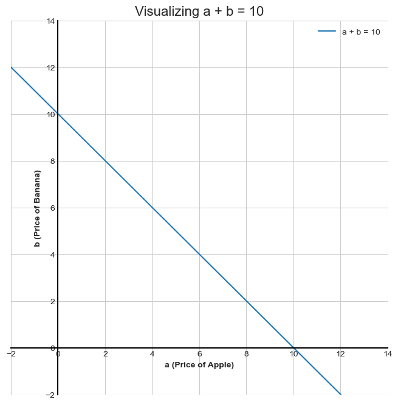
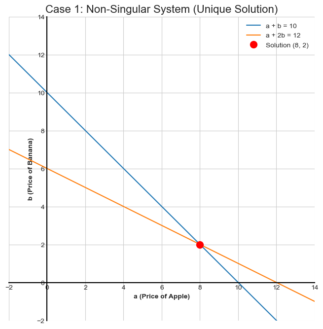
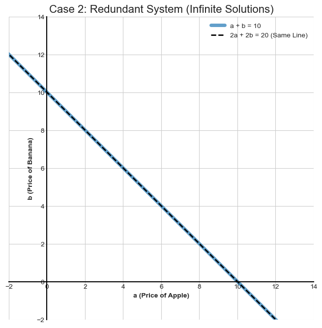
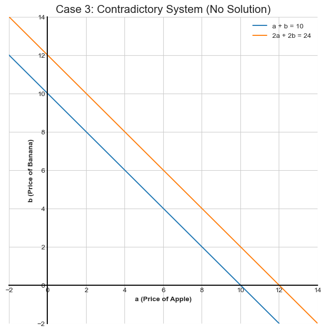
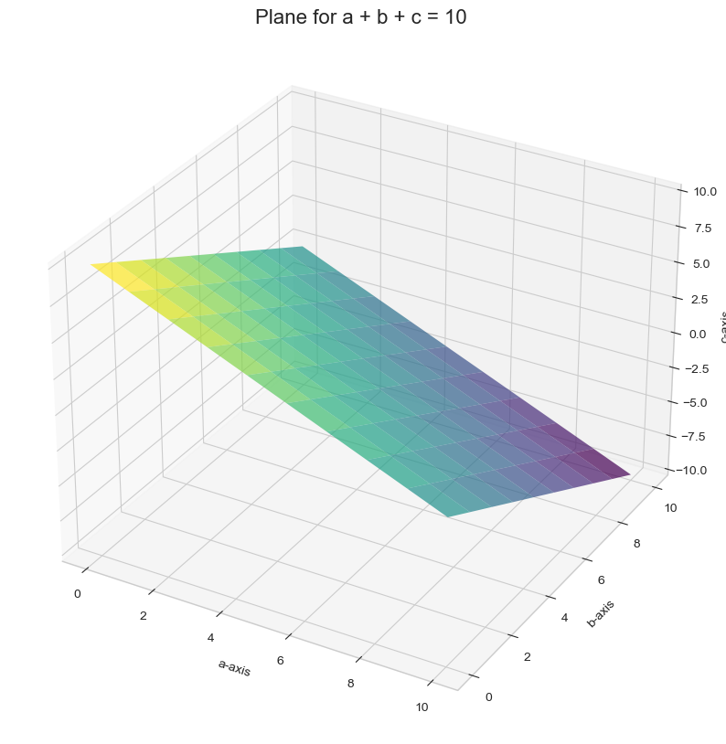

# Visualizing Systems of Equations as Lines and Planes

So far, we've treated systems of equations as algebraic problems. Now, let's visualize them. This geometric interpretation is one of the most powerful aspects of linear algebra.

* An equation with two variables (e.g., $a + b = 10$) can be drawn as a **line** on a 2D plane.
* An equation with three variables (e.g., $a + b + c = 10$) can be drawn as a **plane** in 3D space.

A **system of equations** is simply the visualization of all the lines or planes together on the same graph. The **solution** to the system is the point (or points) where they all intersect.

## Visualizing a Single Equation as a Line

Let's take our familiar equation:
```math
a + b = 10
```
<br>

How do we draw this? We just need to find some pairs of `(a, b)` that are solutions and plot them.
* If `a = 10`, then `b = 0`. This gives us the point **(10, 0)**.
* If `a = 0`, then `b = 10`. This gives us the point **(0, 10)**.
* If `a = 8`, then `b = 2`. This gives us the point **(8, 2)**.

If we plot these points and connect them, we get a line. Every single point on that line is a valid solution to the equation $a + b = 10$.



## Case 1: The Non-Singular System (Unique Solution)

Remember this system?
1.  $a + b = 10$
2.  $a + 2b = 12$

Geometrically, this is a system of two different lines. The solution is the single point where they **intersect**. As we can see from the plot, they cross at the point **(8, 2)**. This is the one and only point that lies on *both* lines, and it's the unique solution we found algebraically.

Because the lines intersect at a single, unique point, we call this a **non-singular** system. Each equation (line) provides new, useful information.



## Case 2: The Redundant System (Infinite Solutions)

Now for the redundant system:
1.  $a + b = 10$
2.  $2a + 2b = 20$

The second equation is just the first one multiplied by 2. They contain the exact same information. Geometrically, this means they represent the **exact same line**.

When we plot them, the lines lie directly on top of each other. The "intersection" is the entire line itself. Since there are infinite points on a line, the system has **infinite solutions**. This is a classic **redundant** and **singular** system.



## Case 3: The Contradictory System (No Solution)

Finally, the contradictory system:
1.  $a + b = 10$
2.  $2a + 2b = 24$

If we simplify the second equation by dividing by 2, we get $a + b = 12$. So the system is really:
1.  $a + b = 10$
2.  $a + b = 12$

These lines have the same slope but different intercepts. Geometrically, this means the lines are **parallel**. Parallel lines never cross, so there is no point that satisfies both equations. The system has **no solution**. This is a **contradictory** and **singular** system.



## Extending to 3D: Equations as Planes

The same logic extends to three dimensions. An equation with three variables, like:
```math
a + b + c = 10
```
<br>

...is represented by a flat **plane** in 3D space.

A system of three such equations corresponds to an arrangement of three planes. The solution is where all three planes intersect.

* **Unique Solution (Non-Singular):** The three planes intersect at a single point, like the corner of a room.
* **Infinite Solutions (Singular):** The planes intersect along a common line (like the spine of a book), or all three planes are the exact same plane.
* **No Solution (Singular):** The planes are parallel, or two are parallel, or they intersect in a way that forms a triangular prism with no common point for all three.

Visualizing these can be tricky, but the concept is the same: the solution is the common intersection.



