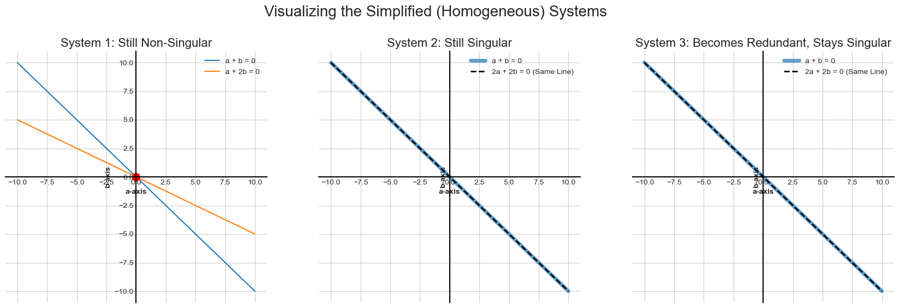

# A Geometric Notion of Non-Singularity

We've established a clear link between the algebra of a system and its geometry:
* **Non-singular systems** correspond to lines that intersect at a unique point.
* **Singular systems** correspond to lines that are parallel (either overlapping or separate).

In this lesson, we'll discover an even simpler way to visualize and understand the core difference between singularity and non-singularity by making a small adjustment to our equations.

## Focusing on the Core Difference: Parallel vs. Non-Parallel

Let's look at the geometry of our three example systems again.

| System 1 (Non-Singular) | System 2 (Singular) | System 3 (Singular) |
| :---: | :---: | :---: |
|  |  |  |
| Lines are **not parallel**. | Lines are **parallel** (overlapping). | Lines are **parallel** (separate). |

Notice that the two singular systems are geometrically similar—both involve parallel lines. The non-singular system is the odd one out. This suggests that the property of being "parallel" is the key indicator of singularity.

Is there a way to simplify our view so that the two types of singular systems look the same, making the distinction between singular and non-singular crystal clear? Yes, there is.

## The Simplification: Setting Constants to Zero

The trick is to temporarily ignore the **constant terms** in the equations—the numbers that aren't attached to a variable. These systems, where the constants on the right-hand side are all zero, are called **homogeneous systems**.

Let's see what happens when we turn all the constants in our three systems into zero.

* **Original System 1:**
    * $a + b = 10$
    * $a + 2b = 12$
    * **Becomes ➔** $a + b = 0$ and $a + 2b = 0$  

* **Original System 2:**
    * $a + b = 10$
    * $2a + 2b = 20$
    * **Becomes ➔** $a + b = 0$ and $2a + 2b = 0$  

* **Original System 3:**
    * $a + b = 10$
    * $2a + 2b = 24$
    * **Becomes ➔** $a + b = 0$ and $2a + 2b = 0$  

An immediate consequence of this change is that **(0, 0) is now a solution for every single equation**. This means all the lines in our new plots must pass through the **origin**.

## Analyzing the Results

What happened to our systems after we set the constants to zero?

* **System 1 (Non-Singular):** The two lines still intersect at a single, unique point. That point is now the origin (0, 0). The system's fundamental nature **did not change**; it remains **non-singular**.

* **System 2 (Redundant Singular):** The two lines are still identical, passing through the origin. The system remains **singular**.

* **System 3 (Contradictory Singular):** This is the most interesting change! The two separate parallel lines **collapsed into a single line** that passes through the origin. The system went from being *contradictory* (no solution) to *redundant* (infinite solutions). However, what's crucial is that it **remained singular**.

## The Key Takeaway 💡

This experiment reveals a fundamental truth of linear algebra:

> **The constants in a system of equations do not affect whether the system is singular or non-singular.**

Singularity is a property of the **coefficients of the variables** (e.g., the `2` in `2a`). These coefficients determine the slopes and orientations of the lines. The constants only shift the lines around without changing their orientation.

This means that to determine if a system is singular or non-singular, we only need to look at its simplified **homogeneous** version. The question simply becomes:
* Do the lines intersect **only** at the origin? (Non-singular)
* Do the lines **overlap** entirely? (Singular)