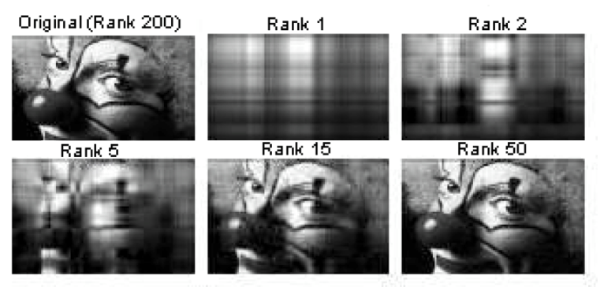

# The Rank of a Matrix

We've been building an intuition for how much "information" a system of equations carries. The **rank** of a matrix is the formal, numerical measure for this concept.

A great practical application of rank in machine learning is **image compression**. An image can be represented as a matrix of pixel intensities. The rank of this matrix is related to its complexity. By using techniques like Singular Value Decomposition (SVD), we can reduce the rank of the matrix, creating a slightly blurrier but much smaller version of the image.

## Defining and Calculating Rank

The "rank" of a system is simply the number of unique, non-redundant pieces of information it contains. This idea extends directly to matrices.

Let's look at our three 2x2 homogeneous systems from before:

* **System 1 (Non-Singular):** Had 2 unique pieces of information. ➔ **Rank = 2**
* **System 2 (Singular, Redundant):** Had 1 unique piece of information. ➔ **Rank = 1**
* **System 3 (Singular, Trivial):** Had 0 pieces of information. ➔ **Rank = 0**

## The Rank-Nullity Relationship

There is a fundamental relationship between a matrix's rank and the **dimension of its solution space** (also called the "null space"). Recall the dimensions we found for our examples:

| System Type                | Solution Space                  | Dimension of Solution Space | Rank |
| :------------------------- | :----------------------------- | :------------------------- | :--- |
| Non-Singular               | A single point (the origin)    | 0                          | 2    |
| Singular (Redundant)       | A line                         | 1                          | 1    |
| Singular (Trivial)         | A plane (all possible solutions)| 2                          | 0    |

This reveals a crucial formula, a version of the **Rank-Nullity Theorem**:

> **Rank + Dimension of Solution Space = Number of Columns**

For our 2x2 matrices, the number of columns is 2, and the formula holds perfectly:
* $2 + 0 = 2$
* $1 + 1 = 2$
* $0 + 2 = 2$

This gives us our best and most practical definition of singularity:

> A square matrix is **non-singular** if and only if it has **full rank** (meaning its rank is equal to its number of columns/rows).

A full-rank matrix has no redundant information, its solution space is just a single point (dimension 0), and every equation in its system contributes something new.

---

**Next:** [The Rank of a Matrix in General](./07_the_rank_of_a_matrix_in_general.md)