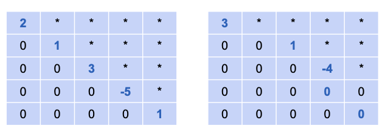

# Row Echelon Form in General

A matrix is in row echelon form if it satisfies the following conditions:

1.  If a row contains all zeros, it must be at the bottom of the matrix.
2.  The first non-zero number in any non-zero row (called the **pivot** or leading entry) must be to the right of the pivot of the row above it.

This creates a "staircase" pattern of pivots.

**General Examples:**

## A Note on Pivots

In many textbooks, the pivots can be any non-zero number. However, for consistency with our method of solving equations (where we normalize by dividing by the leading coefficient), **in this course, we will always take the extra step to make all pivots equal to 1.**

This is a cosmetic step that doesn't change the rank or the nature of the matrix, but it keeps our process consistent.

## Calculating Row Echelon Form for 3x3 Matrices

Let's apply the row reduction algorithm to the singular matrices from our previous lesson, showing the result after each step.

### Example 1

**Original Singular Matrix:**  

$$
\begin{bmatrix}
1 & 1 & 1 \\
1 & 1 & 2 \\
1 & 1 & 3
\end{bmatrix}
$$

**Step 1:** Subtract Row 1 from Row 2 and Row 3.  

$$
\begin{bmatrix}
1 & 1 & 1 \\
0 & 0 & 1 \\
0 & 0 & 2
\end{bmatrix}
$$

**Step 2:** Subtract 2 times the new Row 2 from the new Row 3.  

$$
\begin{bmatrix}
1 & 1 & 1 \\
0 & 0 & 1 \\
0 & 0 & 0
\end{bmatrix}
$$

This final matrix is the **Row Echelon Form**.

### Example 2

**Original Singular Matrix:**

$$
\begin{bmatrix}
1 & 1 & 1 \\
2 & 2 & 2 \\
3 & 3 & 3
\end{bmatrix}
$$

**Step 1:** Subtract 2 times Row 1 from Row 2.  

$$
\begin{bmatrix}
1 & 1 & 1 \\
0 & 0 & 0 \\
3 & 3 & 3
\end{bmatrix}
$$

**Step 2:** Subtract 3 times Row 1 from Row 3.  

$$
\begin{bmatrix}
1 & 1 & 1 \\
0 & 0 & 0 \\
0 & 0 & 0
\end{bmatrix}
$$

This final matrix is the **Row Echelon Form**.

## The Easiest Way to Calculate Rank

The row echelon form gives us the simplest possible way to find the rank of a matrix.

> **The rank of a matrix is the number of pivots (or, equivalently, the number of non-zero rows) in its row echelon form.**

Let's check the ranks of all the matrices we've analyzed:

| Matrix Type            | Row Echelon Form                                                                 | Number of Pivots | Rank |
| :--------------------- | :------------------------------------------------------------------------------ | :--------------: | :--: |
| **Non-Singular**       | $\begin{bmatrix} 1 & * & * \\ 0 & 1 & * \\ 0 & 0 & 1 \end{bmatrix}$             |        3         |  **3** |
| **Singular (Ex 1)**    | $\begin{bmatrix} 1 & 1 & 1 \\ 0 & 0 & 1 \\ 0 & 0 & 0 \end{bmatrix}$             |        2         |  **2** |
| **Singular (Ex 2)**    | $\begin{bmatrix} 1 & 1 & 1 \\ 0 & 0 & 0 \\ 0 & 0 & 0 \end{bmatrix}$             |        1         |  **1** |
| **Zero Matrix**        | $\begin{bmatrix} 0 & 0 & 0 \\ 0 & 0 & 0 \\ 0 & 0 & 0 \end{bmatrix}$             |        0         |  **0** |

---

**Next:** []