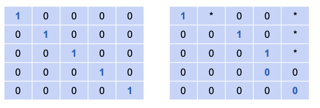

# Reduced Row Echelon Form

In the previous lesson, we learned how to get a matrix into **row echelon form (REF)**. The final step in this simplification process is to transform it into **reduced row echelon form (RREF)**.

If REF corresponds to an intermediate, "staircase" form of a system, then RREF corresponds to the **fully solved system**.

## The Rules of Reduced Row Echelon Form

A matrix is in RREF if it satisfies two conditions:
1.  It is in row echelon form.
2.  Every entry in a column that contains a pivot must be zero (except for the pivot itself). This means we eliminate the non-zero values both **below and above** the pivots.

## From REF to RREF: The Final Step

The process to get from REF to RREF is to **use the pivot in each row to eliminate any non-zero entries *above* it.** This is essentially the back-substitution step from solving equations, but performed with row operations.

For example, if we have this REF matrix:  

$$
\begin{bmatrix}
1 & 2 \\
0 & 1
\end{bmatrix}
$$  

We use the `1` in the second row to eliminate the `2` above it.  

* **Operation:** New Row 1 = Row 1 - (2 * Row 2)  

This gives us the final RREF matrix:  

$$
\begin{bmatrix}
1 & 0 \\
0 & 1
\end{bmatrix}
$$

## From REF to RREF: A 3x3 Example

Let's take a larger matrix that is already in row echelon form and convert it to RREF. The process is the same: start from the bottom pivot and work your way up, clearing the entries above each pivot.

**Given REF Matrix:**  

$$
\begin{bmatrix}
1 & 2 & 3 \\
0 & 1 & 4 \\
0 & 0 & 1
\end{bmatrix}
$$

### Step 1: Use the Pivot in Row 3 to Clear Above

We use the `1` in the bottom-right corner to create zeros in the third column of Row 1 and Row 2.

* **Operation 1:** New Row 2 = Row 2 - (4 * Row 3)
* **Operation 2:** New Row 1 = Row 1 - (3 * Row 3)

This results in the following matrix:  

$$
\begin{bmatrix}
1 & 2 & 0 \\
0 & 1 & 0 \\
0 & 0 & 1
\end{bmatrix}
$$

### Step 2: Use the Pivot in Row 2 to Clear Above

Now, we use the `1` in the second row to create a zero in the second column of Row 1.

* **Operation:** New Row 1 = Row 1 - (2 * Row 2)

This gives us our final matrix:  

$$
\begin{bmatrix}
1 & 0 & 0 \\
0 & 1 & 0 \\
0 & 0 & 1
\end{bmatrix}
$$  

This is the **Reduced Row Echelon Form** of our original matrix.

---

**Next:** []