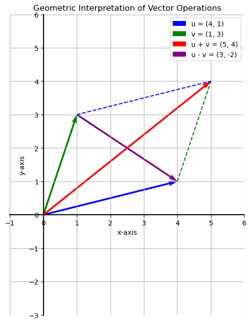
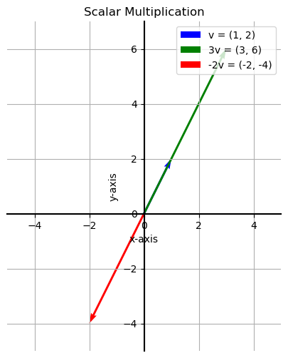

# Vector Operations

Just as we can perform arithmetic with numbers, we can perform operations like addition, subtraction, and scalar multiplication with vectors. These operations have both an algebraic formula and an intuitive geometric interpretation.

## Vector Addition and Subtraction

To add or subtract two vectors, we simply add or subtract their corresponding components.

**Formulas:**  
Given two vectors 

$$ 
u = \begin{bmatrix} u_1 \\ u_2 \end{bmatrix} 
$$

and  

$$ 
v = \begin{bmatrix} v_1 \\ v_2 \end{bmatrix} 
$$

- **Sum:**  

$$
u + v = \begin{bmatrix} u_1 + v_1 \\ u_2 + v_2 \end{bmatrix} 
$$

- **Difference:**  

$$
u - v = \begin{bmatrix} u_1 - v_1 \\ u_2 - v_2 \end{bmatrix}
$$

#### Geometric Interpretation:
Geometrically, the sum of two vectors $u$ and $v$ corresponds to the **main diagonal** of the parallelogram formed by the two vectors. The difference $u - v$ corresponds to the **other diagonal**.

### Using Vector Difference to Measure Distance

The difference between two vectors is very useful for calculating the "distance" between them. In machine learning, we often want to measure the similarity between two data points (represented as vectors), and the norm of their difference is a common way to do this.

Given two vectors $x = (1, 5)$ and $y = (6, 2)$:

- **L1 Distance:**  

$$
||x - y||_1 = |1-6| + |5-2| = |-5| + |3| = 5 + 3 = 8
$$

- **L2 Distance:**  

$$
||x - y||_2 = \sqrt{(1-6)^2 + (5-2)^2} = \sqrt{(-5)^2 + 3^2} = \sqrt{25 + 9} = \sqrt{34} \approx 5.83
$$

## Scalar Multiplication

We can multiply a vector by a single number (a **scalar**). This operation scales the vector's magnitude and, if the scalar is negative, reverses its direction.

**Formula:**  
Given a vector 

$$
v = \begin{bmatrix} v_1 \\ v_2 \end{bmatrix}
$$

and a scalar $\lambda$:

$$
\lambda v = \begin{bmatrix} \lambda v_1 \\ \lambda v_2 \end{bmatrix}
$$

- **If $\lambda > 0$:** The vector is stretched by a factor of $\lambda$.
- **If $\lambda < 0$:** The vector is stretched by a factor of $|\lambda|$ and reflected about the origin.

---

**Next:** []