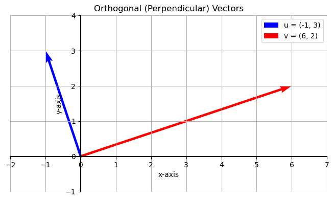
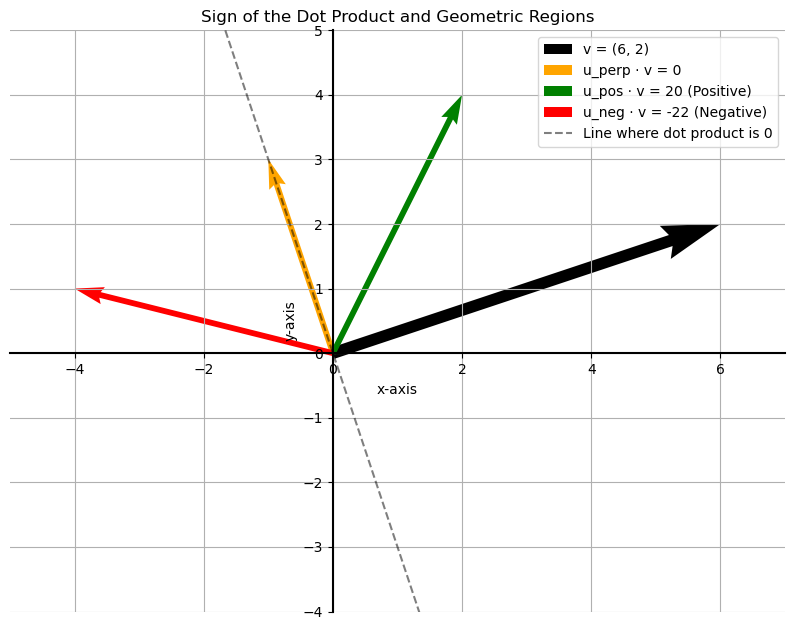

# The Geometric Dot Product

The dot product has a powerful geometric interpretation that relates to the **angle** between two vectors.

The most important special case is when two vectors are **orthogonal** (perpendicular).

> **Rule:** Two vectors are orthogonal if and only if their dot product is **zero**.

Let's consider the vectors $u = (-1, 3)$ and $v = (6, 2)$. Their dot product is:
$$
u \cdot v = (-1)(6) + (3)(2) = -6 + 6 = 0
$$

Since their dot product is 0, these vectors must be perpendicular, as we can see in the plot below.

---

## The General Geometric Formula

We know two special cases:
1.  $v \cdot v = ||v||^2$ (The dot product of a vector with itself is its magnitude squared).
2.  If $u \perp v$, then $u \cdot v = 0$.

What about the dot product for any two vectors $u$ and $v$? The formula connects the dot product to the angle, $\theta$, between the two vectors.

> **Geometric Formula for the Dot Product:**  
> $ u \cdot v = ||u|| \cdot ||v|| \cdot \cos(\theta) $

This formula tells us that the dot product is the product of the magnitudes of the two vectors, scaled by the cosine of the angle between them.

The term $||u|| \cos(\theta)$ represents the **projection** of vector $u$ onto vector $v$—the "shadow" that $u$ casts on $v$. So, the dot product is the length of this shadow multiplied by the length of $v$.

---

## The Sign of the Dot Product

This formula gives us a powerful intuition: the **sign** of the dot product tells us about the angle between the vectors.

Consider a vector $v = (6, 2)$. Any vector orthogonal to it will have a dot product of 0.
- Vectors that form an **acute angle** ($< 90^\circ$) with $v$ will have a **positive** dot product.
- Vectors that form an **obtuse angle** ($> 90^\circ$) with $v$ will have a **negative** dot product.

This effectively divides the entire 2D plane into three regions relative to vector $v$.

---

**Next:** []