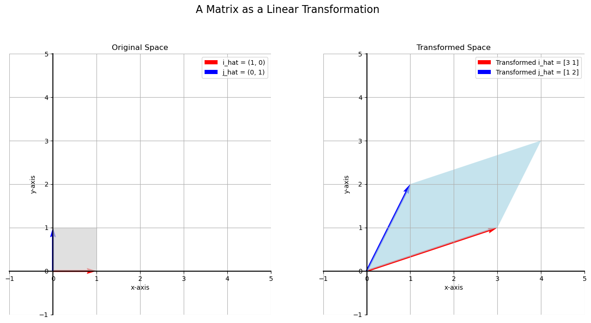

# Matrices as Linear Transformations

In the previous lessons, we've seen matrices as a way to represent systems of linear equations. Now, we'll explore another, very powerful interpretation: a matrix can be seen as a **linear transformation**.

A linear transformation is a function that takes a point (or vector) in a space and maps it to a new point in a way that preserves lines and keeps the origin fixed. In 2D, you can think of it as a way of stretching, shearing, rotating, or reflecting the entire plane.

## The Transformation Process

Let's consider a 2x2 matrix. This matrix will define a transformation that maps any point from an "input" plane to a new point in an "output" plane.

**Transformation Matrix:**  

$$
A = \begin{bmatrix} 3 & 1 \\ 
1 & 2 \end{bmatrix}
$$

The process is simple: to find where a point $(a, b)$ goes, we represent it as a column vector and multiply it by the matrix $A$.

$$
\text{new-vector} = A \cdot \begin{bmatrix} a \\ 
b \end{bmatrix}
$$

Let's see how this matrix transforms the fundamental building blocks of our plane. The vectors $(1, 0)$ and $(0, 1)$ are called **basis vectors**. Where they land after the transformation tells us everything about how the entire space is warped.

#### Transforming (1, 0):

$$
\begin{bmatrix} 3 & 1 \\ 
1 & 2 \end{bmatrix} \begin{bmatrix} 1 \\ 
0 \end{bmatrix} = \begin{bmatrix} (3)(1)+(1)(0) \\ 
(1)(1)+(2)(0) \end{bmatrix} = \begin{bmatrix} 3 \\ 
1 \end{bmatrix}
$$

- **Transforming (0, 1):**

  $$
  \begin{bmatrix} 3 & 1 \\ 1 & 2 \end{bmatrix} \begin{bmatrix} 0 \\ 1 \end{bmatrix} = \begin{bmatrix} (3)(0)+(1)(1) \\ (1)(0)+(2)(1) \end{bmatrix} = \begin{bmatrix} 1 \\ 2 \end{bmatrix}
  $$

Notice that the transformed basis vectors are simply the **columns of the matrix $A$**!

The visualization below shows how the unit square formed by the original basis vectors is transformed into a parallelogram formed by the columns of our matrix.

---

## A Change of Coordinates

Because the transformation is linear, the entire grid of the input space gets warped uniformly. This means we can think of the transformation as a **change of coordinates**.

To find where any point goes, we can express it as a combination of the original basis vectors. For example, the point $(-2, 3)$ can be written as:

> $(-2, 3) = -2 \cdot (1, 0) + 3 \cdot (0, 1) = -2\hat{i} + 3\hat{j}$

To find its transformed location, we just take the same combination of the *transformed* basis vectors:

> $\text{Transformed Point} = -2 \cdot (3, 1) + 3 \cdot (1, 2) = (-6, -2) + (3, 6) = (-3, 4)$

This matches what we get from direct matrix multiplication:

> $$
> \begin{bmatrix} 3 & 1 \\ 1 & 2 \end{bmatrix} \begin{bmatrix} -2 \\ 3 \end{bmatrix} = \begin{bmatrix} (3)(-2)+(1)(3) \\ (1)(-2)+(2)(3) \end{bmatrix} = \begin{bmatrix} -3 \\ 4 \end{bmatrix}
> $$

---

## The "Apples and Bananas" Analogy

We can also think of this transformation in a data context. Imagine the matrix represents the fruit you buy on two separate days:

$$
\begin{bmatrix}
3 & 1 \\
1 & 2
\end{bmatrix}
\quad
\begin{matrix}
\leftarrow \text{Day 1: 3 apples, 1 banana} \\
\leftarrow \text{Day 2: 1 apple, 2 bananas}
\end{matrix}
$$

The input vector represents the **prices** of the fruit:

$$
\begin{bmatrix} a \\ b \end{bmatrix}
\quad
\begin{matrix}
\leftarrow \text{Price of an apple} \\
\leftarrow \text{Price of a banana}
\end{matrix}
$$

The matrix-vector multiplication transforms a vector of **prices** into a vector of **total daily costs**:

$$
\begin{bmatrix} 3 & 1 \\ 1 & 2 \end{bmatrix} \begin{bmatrix} a \\ b \end{bmatrix} = \begin{bmatrix} 3a + b \\ a + 2b \end{bmatrix}
\quad
\begin{matrix}
\leftarrow \text{Total cost on Day 1} \\
\leftarrow \text{Total cost on Day 2}
\end{matrix}
$$

So, if apples and bananas both cost 1 dollar ($a=1$, $b=1$), the transformation sends the price vector $(1, 1)$ to the cost vector $(4, 3)$.