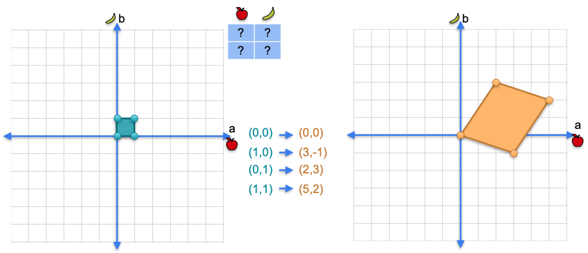
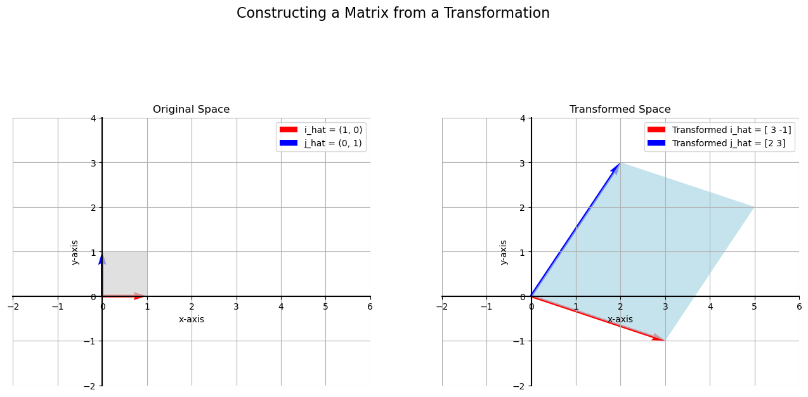

# Linear Transformations as Matrices

In the previous video, we learned how to turn a matrix into a linear transformation. Going the other way around—starting with a transformation and finding its matrix—is just as easy.

The key is to understand where the **basis vectors**, $\hat{i} = (1, 0)$ and $\hat{j} = (0, 1)$, land after the transformation. These two vectors are the fundamental building blocks of our 2D space. Once we know their destinations, we can determine the matrix for the entire transformation.

Let's say we have an unknown 2x2 matrix, but we know it transforms the unit square into the following parallelogram:

From this, we can see:  
* The vector $\begin{bmatrix} 1 \\ 0 \end{bmatrix}$ gets sent to the vector  
  $\begin{bmatrix} 3 \\ -1 \end{bmatrix}$  
* The vector $\begin{bmatrix} 0 \\ 1 \end{bmatrix}$ gets sent to the vector  
  $\begin{bmatrix} 2 \\ 3 \end{bmatrix}$

---

## The Core Rule: Transformed Basis Vectors are the Columns

This reveals the fundamental connection between a 2D linear transformation and its 2x2 matrix:

> **The columns of the matrix are the vectors where the original basis vectors, $\hat{i}$ and $\hat{j}$, land.**

So, if we know that:  
* $\hat{i} = \begin{bmatrix} 1 \\ 0 \end{bmatrix}$ transforms to $\begin{bmatrix} 3 \\ -1 \end{bmatrix}$  
* $\hat{j} = \begin{bmatrix} 0 \\ 1 \end{bmatrix}$ transforms to $\begin{bmatrix} 2 \\ 3 \end{bmatrix}$

Then the matrix that performs this transformation must be:

$
A = \begin{bmatrix} 3 & 2 \\
-1 & 3 \end{bmatrix}
$

The first column is the transformed $\hat{i}$, and the second column is the transformed $\hat{j}$. It's that simple. Let's visualize this to confirm.

---

## Interactive Exploration

The best way to build a strong, visual intuition for linear transformations is to play with them yourself. The interactive tools linked below allow you to change the values in a 2x2 matrix and see in real-time how it stretches, shears, and rotates the 2D space.

* **[Linear Transformation Tools on GeoGebra](https://www.geogebra.org/search/linear%20transformations)**

As you adjust the matrix values in the tool, pay close attention to where the basis vectors (often shown in red and green) land. You will see that they always correspond to the columns of the matrix you've defined.