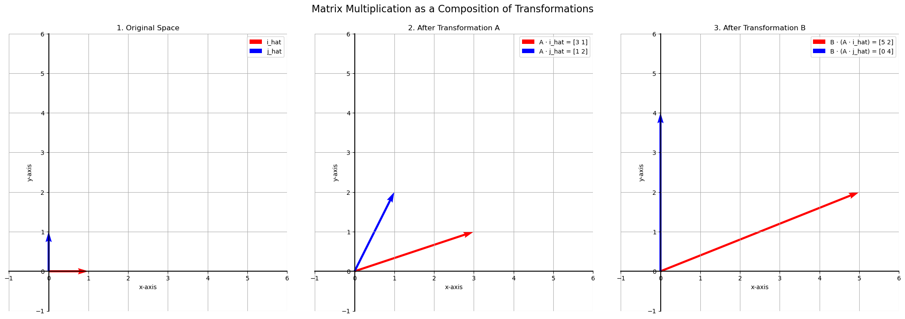

# Matrix Multiplication

In the previous lessons, we've learned how to multiply a matrix by a vector. Now, we'll extend that to multiplying a matrix by another matrix.

The most intuitive way to understand matrix multiplication is to see it as the **composition of two linear transformations**. If we apply one transformation to our space and then immediately apply a second transformation, the combined effect can be described by a single, new matrix. This new matrix is the **product** of the first two.

## A Geometric Example

Let's see this in action. We'll use two transformations:

#### Transformation 1 (Matrix A):

$$
A = \begin{bmatrix} 3 & 1 \\ 
1 & 2 \end{bmatrix}
$$

#### Transformation 2 (Matrix B):

$$
B = \begin{bmatrix} 2 & -1 \\ 
0 & 2 \end{bmatrix}
$$

We will start with our standard basis vectors, apply Transformation A, and then apply Transformation B to the result.

# The Resulting Matrix

The combined transformation maps the original basis vectors to their final destinations:

$$
\hat{i} = \begin{bmatrix} 1 \\ 
0 \end{bmatrix}
$$

...is sent to... 

$$
\begin{bmatrix} 5 \\ 
2 \end{bmatrix}
$$  

...and...

$$
\hat{j} = \begin{bmatrix} 0 \\ 
1 \end{bmatrix}
$$

...is sent to... 

$$
\begin{bmatrix} 0 \\ 
4 \end{bmatrix}
$$

As we learned before, the matrix for this combined transformation is simply the one whose columns are these new basis vectors.

#### Combined Matrix (C):

$$
C = \begin{bmatrix} 5 & 0 \\ 
2 & 4 \end{bmatrix}
$$

This matrix $C$ is the **product** of matrices $B$ and $A$.

$$
C = B \cdot A
$$

**Important Note on Order:** The order of multiplication is crucial and works in reverse. Because transformations are applied from the right (e.g., $A \cdot v$), the first transformation to be applied ($A$) is on the right, and the second ($B$) is on the left.

## The Algebraic Method: Dot Products

There is a much faster way to calculate the product of two matrices without visualizing the transformations. The rule is:

> **The entry in the *i*-th row and *j*-th column of the product matrix is the dot product of the *i*-th row of the first matrix and the *j*-th column of the second matrix.**

Let's calculate $B \cdot A$:

$$
B \cdot A = \begin{bmatrix} 2 & -1 \\ 
0 & 2 \end{bmatrix} \begin{bmatrix} 3 & 1 \\ 
1 & 2 \end{bmatrix}
$$

* **Top-Left Entry (Row 1 of B · Col 1 of A):**  

$$
\begin{bmatrix} 2 & -1 \end{bmatrix} \cdot \begin{bmatrix} 3 \\ 
1 \end{bmatrix} = (2)(3) + (-1)(1) = 5
$$

* **Top-Right Entry (Row 1 of B · Col 2 of A):**  

$$
\begin{bmatrix} 2 & -1 \end{bmatrix} \cdot \begin{bmatrix} 1 \\ 
2 \end{bmatrix} = (2)(1) + (-1)(2) = 0
$$

* **Bottom-Left Entry (Row 2 of B · Col 1 of A):**  

$$
\begin{bmatrix} 0 & 2 \end{bmatrix} \cdot \begin{bmatrix} 3 \\ 
1 \end{bmatrix} = (0)(3) + (2)(1) = 2
$$

* **Bottom-Right Entry (Row 2 of B · Col 2 of A):**  

$$
\begin{bmatrix} 0 & 2 \end{bmatrix} \cdot \begin{bmatrix} 1 \\ 
2 \end{bmatrix} = (0)(1) + (2)(2) = 4
$$

The resulting matrix is exactly what we found geometrically:  

$$
\begin{bmatrix} 5 & 0 \\ 
2 & 4 \end{bmatrix}
$$

## Multiplication of Non-Square Matrices

This "row-times-column" dot product rule works for non-square matrices as well, with one important condition:

> **The number of columns of the first matrix must match the number of rows of the second matrix.**

The resulting matrix will have the number of rows from the first matrix and the number of columns from the second.

**Rule:** An **(m x n)** matrix multiplied by an **(n x p)** matrix results in an **(m x p)** matrix.

---

**Next:** [Identity Matrix](./04_identity_matrix.md)