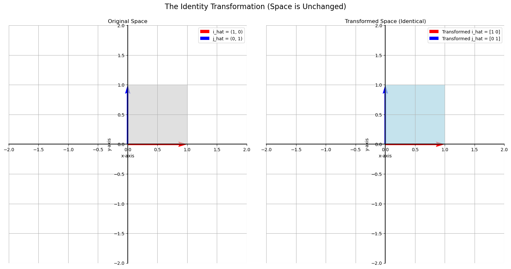

# The Identity Matrix

In standard multiplication, the number **one** is special because multiplying any number by one leaves it unchanged (e.g., $5 \times 1 = 5$).

The **identity matrix**, usually denoted as **I**, plays this exact same role in matrix multiplication. When you multiply any matrix by the identity matrix, you get the same original matrix back.

Its corresponding linear transformation is the simplest one possible: it's the transformation that **leaves the entire space unchanged**.

## The Structure of the Identity Matrix

The identity matrix is a square matrix with **ones on the main diagonal** and **zeros everywhere else**.

#### 2x2 Identity:  

$$
I = \begin{bmatrix} 1 & 0 \\ 
0 & 1 \end{bmatrix}
$$

#### 3x3 Identity:

$$
I = \begin{bmatrix} 1 & 0 & 0 \\ 
0 & 1 & 0 \\ 
0 & 0 & 1 \end{bmatrix}
$$

### Why It Works

When you multiply the identity matrix by any vector, the result is the same vector you started with. Let's see why with a 2x2 example:  

$$
\begin{bmatrix} 1 & 0 \\ 
0 & 1 \end{bmatrix}\begin{bmatrix} a \\ 
b \end{bmatrix} = \begin{bmatrix} (1)(a) + (0)(b) \\ 
(0)(a) + (1)(b) \end{bmatrix} = \begin{bmatrix} a \\ 
b \end{bmatrix}
$$ 

The ones on the diagonal preserve each component, and the zeros ensure that the components don't mix.

## The Identity Transformation

Geometrically, the identity matrix corresponds to a transformation that does nothing. It sends every point in the plane to itself.

The basis vector...  

$$
\begin{bmatrix} 1 \\ 
0 \end{bmatrix}
$$

...is sent to...  

$$
\begin{bmatrix} 1 \\ 
0 \end{bmatrix}
$$

...and the basis vector...  

$$
\begin{bmatrix} 0 \\ 
1 \end{bmatrix}
$$

...is sent to...

$$
\begin{bmatrix} 0 \\ 
1 \end{bmatrix}
$$

The visualization below shows that the "transformed" space is identical to the original space.

---

**Next:** [Matrix Inverse](./05_matrix_inverse.md)