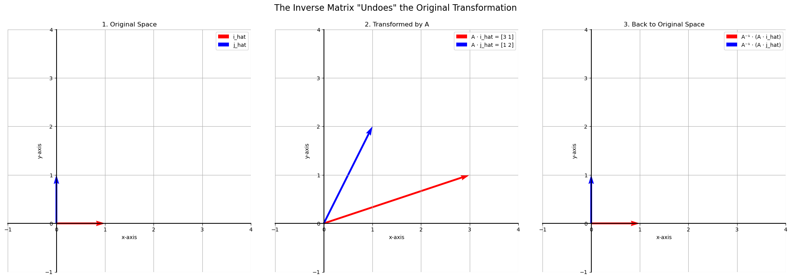
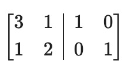
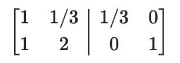
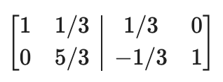
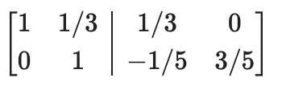
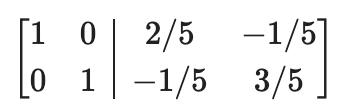

# The Matrix Inverse

In arithmetic, the inverse of a number is what you multiply it by to get 1 (e.g., the inverse of 2 is 1/2, because $2 \times \frac{1}{2} = 1$).

The **inverse of a matrix**, denoted as $A^{-1}$, is the matrix that, when multiplied by the original matrix $A$, results in the **identity matrix** ($I$).  

$$
A \cdot A^{-1} = I
$$

Geometrically, the inverse matrix corresponds to a linear transformation that **"undoes"** the transformation of the original matrix, returning the space to its initial state.

Let's consider our transformation matrix from before:  

$$
A = \begin{bmatrix} 3 & 1 \\ 
1 & 2 \end{bmatrix}
$$

This matrix transforms the unit square into a parallelogram. The inverse matrix, $A^{-1}$, will be the transformation that maps that parallelogram back into the original unit square.

## How to Find the Inverse Matrix

There are two main ways to find the inverse of a matrix by hand. The first is conceptual, and the second is a practical algorithm.

### Method 1: The Conceptual Approach (Solving a System)

To find the entries of the inverse, we can set up and solve a system of linear equations. Let our original matrix be:  

$$
A = \begin{bmatrix} 3 & 1 \\ 
1 & 2 \end{bmatrix}
$$

...and its unknown inverse be:  

$$
A^{-1} = \begin{bmatrix} a & b \\ 
c & d \end{bmatrix}
$$

We know their product must be the identity matrix:  

$$
\begin{bmatrix} 3 & 1 \\ 
1 & 2 \end{bmatrix} \begin{bmatrix} a & b \\ 
c & d \end{bmatrix} = \begin{bmatrix} 1 & 0 \\ 
0 & 1 \end{bmatrix}
$$  

This creates a system of four equations, which can be solved for $a$, $b$, $c$, and $d$. While this works for a 2x2 matrix, it quickly becomes unmanageable for larger matrices.

### Method 2: The Practical Algorithm (Gauss-Jordan Elimination)

This is the standard, scalable method for finding an inverse.

1.  Create an **augmented matrix** by placing your original matrix $A$ on the left and the **identity matrix $I$** of the same size on the right. Our goal is to transform $[A \mid I]$.
2.  Use **row operations** to transform the left side ($A$) into the identity matrix.
3.  Apply the exact same row operations to the right side ($I$) simultaneously.
4.  When the left side becomes the identity matrix, the right side will have become the **inverse matrix, $A^{-1}$**. The final form will be $[I \mid A^{-1}]$.

#### Example:

Let's find the inverse of:  

$$
A = \begin{bmatrix} 3 & 1 \\ 
1 & 2 \end{bmatrix}
$$

**Step 1: Set up the augmented matrix.**

**Step 2: Perform row operations to get RREF on the left side.**

- $R2 = R2 - R1$ (Create a zero below the first pivot)

- $R2 = R2 \times (3/5)$ (Normalize the second pivot)

- $R1 = R1 - (1/3) \times R2$ (Create a zero above the second pivot)

**Step 3: Read the inverse matrix from the right side.**

The left side is now the identity matrix. The right side is our inverse.

$$
A^{-1} = \begin{bmatrix} 2/5 & -1/5 \\ 
-1/5 & 3/5 \end{bmatrix}
$$

## When Does an Inverse Not Exist?

A crucial point in linear algebra is that **not all matrices have an inverse**. A matrix can only be inverted if it is **non-singular**. If you try to perform Gauss-Jordan elimination on a singular matrix, you will find it impossible to get the identity matrix on the left side because you will end up with a row of all zeros.

---

**Next:** [Neural Networks and Matrices](./06_neural_networks_and_matrices.md)