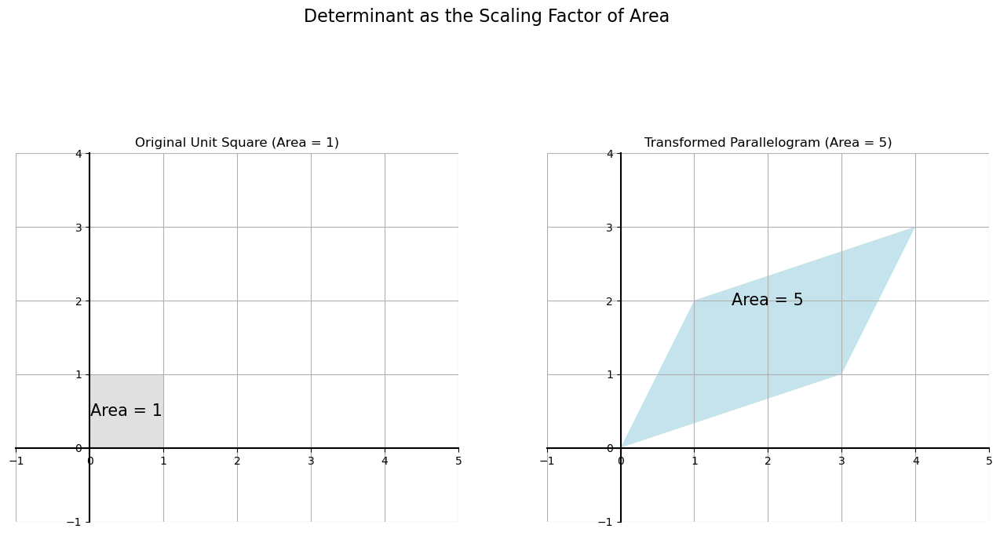
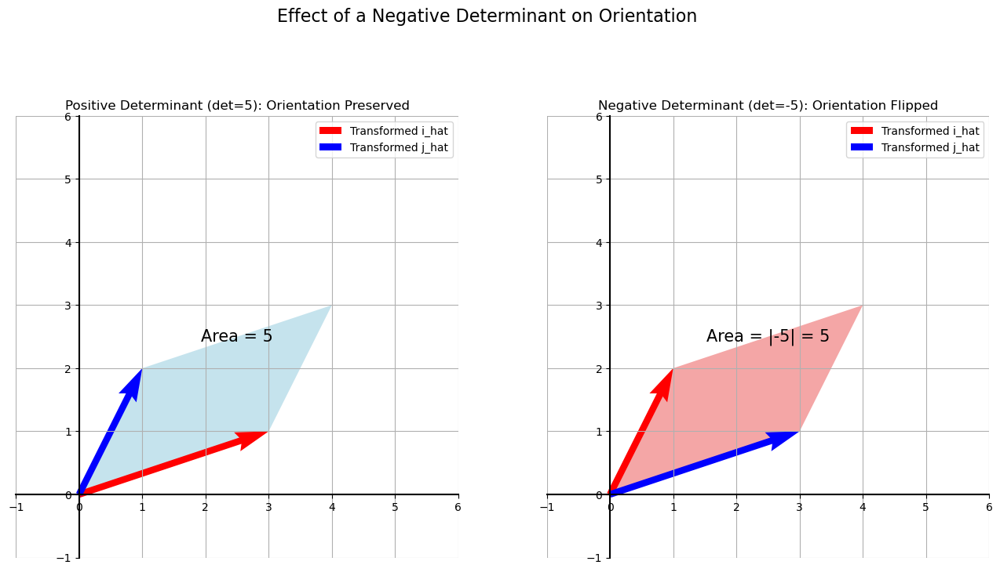

# The Determinant as an Area

In the first week, we learned that the determinant is a number that tells us if a matrix is singular. If `det(A) = 0`, the matrix is singular.

Now, we'll explore the beautiful geometric meaning of this number. For a 2D linear transformation, the determinant tells us the **scaling factor of the area**. It measures how much the area of a shape changes after the transformation is applied.

Specifically, the determinant is the **area of the parallelogram** that the original unit square is transformed into.

## Case 1: Non-Singular Transformation (det ≠ 0)

Let's consider our standard non-singular matrix:  

$$
A = \begin{bmatrix} 3 & 1 \\ 
1 & 2 \end{bmatrix} 
$$  

Its determinant is $(3)(2) - (1)(1) = 5$.

The original unit square, formed by the basis vectors $\hat{i}$ and $\hat{j}$, has an area of 1. When we apply the transformation, this square is warped into a parallelogram. The area of this new parallelogram is exactly **5**, the value of the determinant.

## Case 2: Singular Transformation (det = 0)

What happens with a singular matrix? Let's take our example:  

$$
B = \begin{bmatrix} 1 & 1 \\ 
2 & 2 \end{bmatrix} 
$$  

Its determinant is $(1)(2) - (1)(2) = 0$.

When we apply this transformation, the unit square is collapsed into a flat line segment. A line segment has **zero area**. This is why the determinant is 0.

This gives us the key geometric insight:
> A transformation is **singular** if it squashes space into a lower dimension, reducing its area (or volume) to **zero**.

## What About Negative Determinants?

A determinant can be negative. For example, if we swap the columns of our matrix `A`:  

$$
C = \begin{bmatrix} 1 & 3 \\ 
2 & 1 \end{bmatrix} \implies \det(C) = (1)(1) - (3)(2) = -5 
$$  

A negative determinant means the transformation **inverts the orientation of space**.

Think of the basis vectors $\hat{i}$ (x-axis) and $\hat{j}$ (y-axis). Normally, $\hat{j}$ is 90 degrees counter-clockwise from $\hat{i}$. A transformation with a negative determinant "flips" the space, so that the transformed $\hat{j}$ is now on the "wrong" side of the transformed $\hat{i}$.

The **absolute value** of the determinant, $|-5| = 5$, still tells us the scaling factor of the area. For determining singularity, all that matters is whether the determinant is **zero** or **non-zero**.

---

