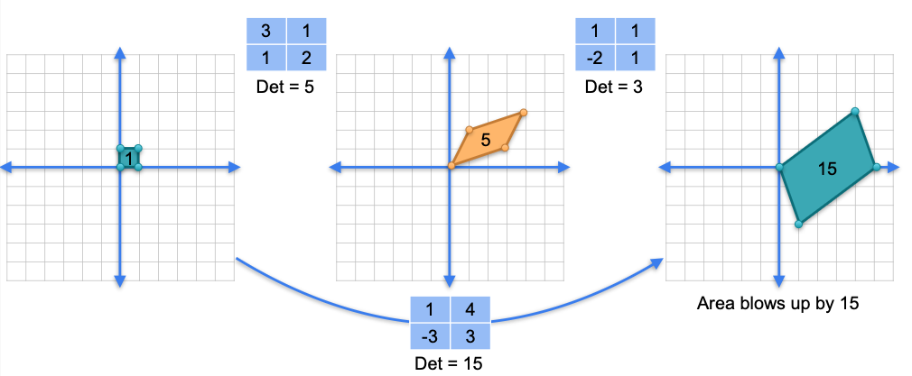
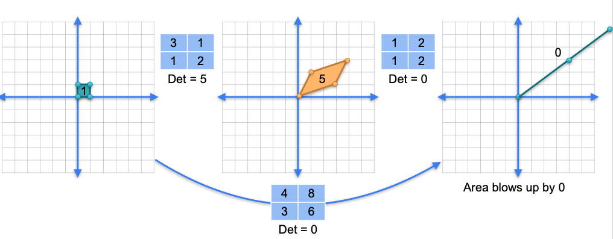

# The Determinant of a Product

Now that we understand the determinant as a geometric scaling factor, we can explore how it behaves when we combine linear transformations through matrix multiplication. This leads to a very simple and powerful rule.

> **Rule:** The determinant of a product of matrices is equal to the product of their individual determinants.
> 
> $\det(A \cdot B) = \det(A) \cdot \det(B)$

Let's verify this with the example matrices:

* **Matrix A (First Transformation):**  

$$
A = \begin{bmatrix} 3 & 1 \\ 
1 & 2 \end{bmatrix} \implies \det(A) = 5
$$

* **Matrix B (Second Transformation):**  

$$
B = \begin{bmatrix} 1 & 1 \\ 
-2 & 1 \end{bmatrix} \implies \det(B) = 3 
$$  

* **Product (C = B · A):**  

$$
\begin{bmatrix} 3 & 1 \\ 
1 & 2 \end{bmatrix} \begin{bmatrix} 1 & 1 \\ 
-2 & 1 \end{bmatrix} = \begin{bmatrix} 1 & 4 \\ 
-3 & 3 \end{bmatrix} 
$$

* **Determinant of Product:**  

$$
\det(C) = (1)(3) - (4)(-3) = 3 - (-12) = 15 
$$

As we can see, 

$$
\det(A) \cdot \det(B) = 5 \times 3 = 15
$$

...so the rule holds.

## The Geometric Intuition

The geometric intuition is the simplest way to understand this rule.

* **Transformation A** scales the area of any shape by a factor of 5 (its determinant).
* **Transformation B** scales the area of any shape by a factor of 3 (its determinant).

When we perform the combined transformation, $B \cdot A$, we are **first applying transformation A**, which scales the area of the unit square from 1 to 5. Then, we are **applying transformation B to that new shape**, which scales its area by another factor of 3.

Therefore, the total scaling factor must be $5 \times 3 = 15$. This is the determinant of the product matrix.

## Product of a Singular and Non-Singular Matrix

What happens if you multiply a singular matrix by a non-singular matrix?

* Let matrix `A` be non-singular, so `det(A) ≠ 0`.
* Let matrix `B` be singular, so `det(B) = 0`.

The determinant of their product `A · B` will be:  

$$
\det(A \cdot B) = \det(A) \cdot \det(B) = \det(A) \cdot 0 = 0 
$$

Since the determinant of the product is 0, the resulting matrix **must be singular**.

**Geometric Intuition:**
If one of your transformations (e.g., B) is singular, it squashes the plane into a lower dimension (a line or a point), which has an area of 0. No matter what the other transformation (A) does, it cannot "un-squash" the space back into a full plane. Once the area is zero, it stays zero.

