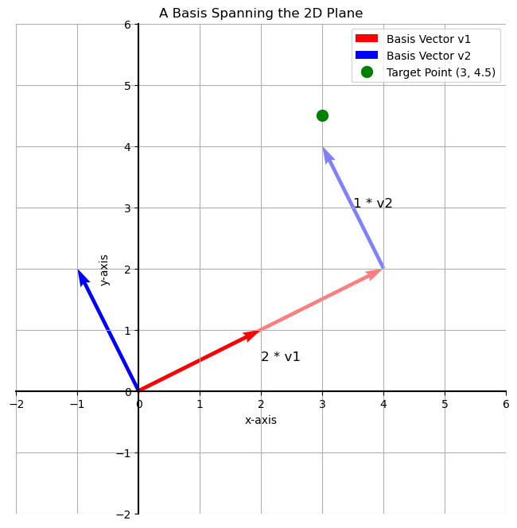
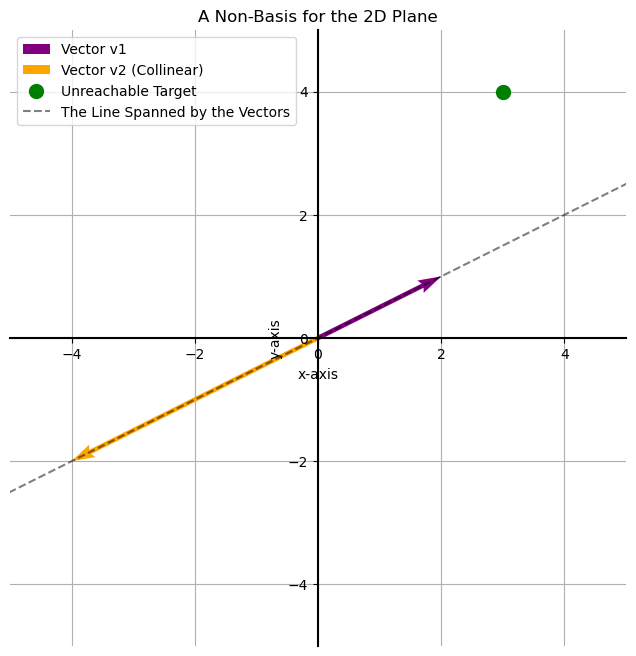

# Bases in Linear Algebra

A fundamental concept in linear algebra is the **basis** of a vector space. We've seen this idea before when we discussed how a matrix transforms the "fundamental square" into a parallelogram. In reality, what matters most are not the shapes themselves, but the two vectors that define them.

A **basis** is a set of vectors that has two key properties:
1.  The vectors are **linearly independent** (in 2D, this means they are not parallel).
2.  They **span** the entire space.

The main property of a basis is that any point in the space can be reached by a unique **linear combination** of the basis vectors. This means we can get to any target point by simply "walking" along the directions of our basis vectors.

## What is NOT a Basis?

Almost any two vectors in a 2D plane will form a basis. The only exception is when the two vectors are **linearly dependent**—meaning they lie on the same line (they are collinear).

If two vectors point in the same (or exact opposite) directions, you can only move back and forth along a single line. It's impossible to "walk" off this line to reach every other point in the plane. Therefore, these two vectors **do not form a basis** for the 2D plane. They only span a 1D subspace (a line).

---

**Next:** [Span in Linear Algebra](./02_span_in_linear_algebra.md)