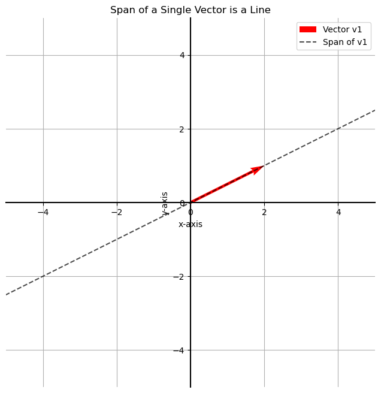

# Span in Linear Algebra

Now that we know what a basis is, a natural question arises: what space does a set of vectors "create"? This idea is captured by the concept of **span**.

> The **span** of a set of vectors is the set of all points that can be reached by a linear combination of those vectors.

In simpler terms, it's all the places you can get to by "walking" along the directions of your given vectors, for any distance, in any order.

## Span of a Single Vector

If you only have one vector, you can only move forwards and backwards along the direction it points. Therefore, the span of a single non-zero vector is always the **line** that contains it and passes through the origin.

## Span of Two Vectors

* If two vectors are **linearly independent** (not on the same line), their span is the entire **2D plane**.
* If two vectors are **linearly dependent** (on the same line), their span is just the **line** containing them.

---
## Basis as a Minimal Spanning Set

This brings us to a more precise definition of a basis.

> A **basis** for a vector space is a **minimal set of vectors that spans the entire space.**

"Minimal" means that if you remove any vector from the basis, it will no longer span the space.

* **Example 1 (A Basis):** The set `{ (2,1), (-1,2) }` is a basis for the 2D plane. It spans the plane, and if you remove either vector, the remaining single vector only spans a line.
* **Example 2 (Not a Basis):** The set `{ (2,1), (-4,-2) }` is not a basis for the 2D plane because it only spans a line.
* **Example 3 (Not a Basis):** The set `{ (2,1), (-1,2), (3,3) }` is not a basis for the 2D plane. While it spans the entire plane, it is not *minimal*. Any one of the vectors is redundant and can be removed without changing the span.

The number of vectors in a basis gives the **dimension** of the space. A line (1D) has a basis of one vector. A plane (2D) has a basis of two vectors.

## Formal Definition of Linear Independence

Let's formally define the concept that underpins what makes a set a basis.

> A set of vectors is **linearly independent** if no vector in the set can be written as a linear combination of the others.

> A set of vectors is **linearly dependent** if at least one vector in the set *can* be written as a linear combination of the others.

Adding a linearly dependent vector to a set **does not increase its span**.

## Checking for Linear Dependence Algebraically

We can check if a set of vectors is linearly dependent by setting up and solving a system of linear equations.

**Problem:** Is the set of vectors $v_1, v_2, v_3$ linearly dependent, where:

* $v_1 = (-1, 1)$
* $v_2 = (2, 1)$
* $v_3 = (-5, 3)$

**Question:** Can we find scalars (constants) $\alpha$ and $\beta$ such that $\alpha v_1 + \beta v_2 = v_3$?

This vector equation can be broken down into a system of equations, one for each component:
* **x-component:** $-\alpha + 2\beta = -5$
* **y-component:** $\alpha + \beta = 3$

Let's solve this system.

1.  **Add the two equations together:**

    * $(-\alpha + \alpha) + (2\beta + \beta) = (-5 + 3)$

    * $3\beta = -2 \implies \beta = -2/3$

2.  **Substitute $\beta$ back into the second equation:**

    * $\alpha + (-2/3) = 3 \implies \alpha = 3 + 2/3 = 11/3$

Since we found a solution ($\alpha = 11/3, \beta = -2/3$), it means that $v_3$ **is** a linear combination of $v_1$ and $v_2$. Therefore, the set of vectors is **linearly dependent**. If the system had no solution, the set would have been linearly independent.

---

**Next:** [Eigenbases](./03_eigenbases.md)