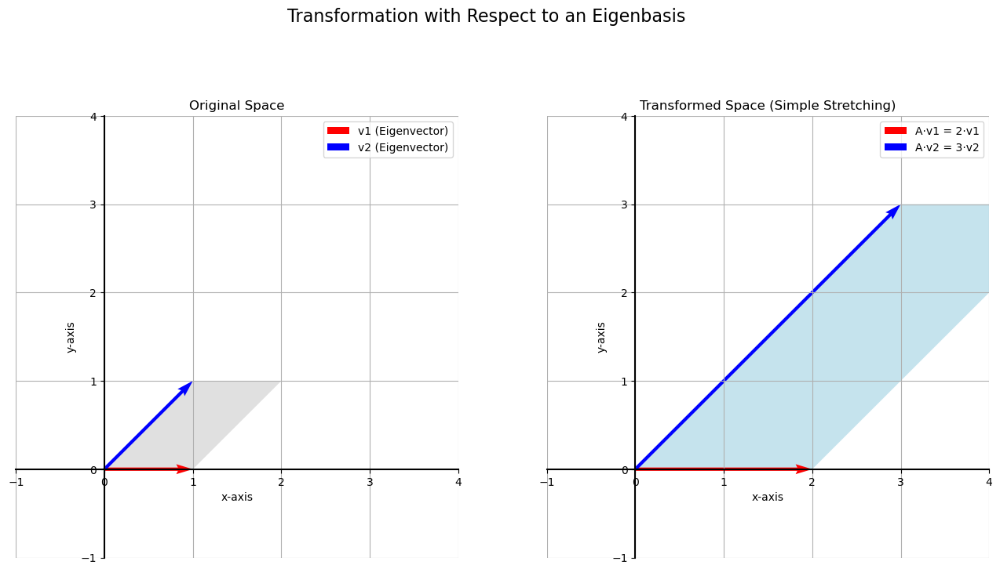

# Eigenbases

We've learned that any set of two linearly independent vectors can form a **basis** for the 2D plane. We've also seen that a matrix acts as a **linear transformation** that can be thought of as a "change of basis."

For example, the standard basis vectors $\hat{i}=(1,0)$ and $\hat{j}=(0,1)$ form a unit square. A transformation matrix tells us where these basis vectors land, warping the square into a parallelogram and defining a new coordinate system.

Let's consider the transformation matrix:

```math
A = \begin{bmatrix} 2 & 1 \\ 0 & 3 \end{bmatrix}  
```
<br>

This matrix transforms the standard basis as follows:

```math
\hat{i} = \begin{bmatrix} 1 \\ 0 \end{bmatrix} \text{is sent to} \begin{bmatrix} 2 \\ 0 \end{bmatrix}  
```
<br>

```math
\hat{j} = \begin{bmatrix} 0 \\ 1 \end{bmatrix} \text{is sent to} \begin{bmatrix} 1 \\ 3 \end{bmatrix}
```
<br>

The unit square is transformed into a parallelogram. While this is a valid change of basis, the choice of the standard basis was arbitrary. Is there a more "natural" or "special" basis for this specific transformation?

## Finding a Special Basis: The Eigenbasis

Let's see what happens if we choose a different basis for our input space. Let's pick the basis formed by the vectors $v_1 = (1, 0)$ and $v_2 = (1, 1)$.

Now, let's apply our transformation matrix `A` to these new basis vectors:

* **Transforming $v_1$:** 

```math
\begin{bmatrix} 2 & 1 \\ 0 & 3 \end{bmatrix} \begin{bmatrix} 1 \\ 0 \end{bmatrix} = \begin{bmatrix} 2 \\ 0 \end{bmatrix}
```
<br>

* **Transforming $v_2$:** 

```math
\begin{bmatrix} 2 & 1 \\ 0 & 3 \end{bmatrix} \begin{bmatrix} 1 \\ 1 \end{bmatrix} = \begin{bmatrix} 3 \\ 3 \end{bmatrix}
```
<br>

Notice something remarkable:
* The vector $(1, 0)$ was transformed to $(2, 0)$. It stayed on the same line and was simply **stretched by a factor of 2**.
* The vector $(1, 1)$ was transformed to $(3, 3)$. It also stayed on the same line and was simply **stretched by a factor of 3**.

When we use this special basis, the complex shearing transformation simplifies into two simple stretches along these specific directions. This special basis is called the **eigenbasis**.



## Eigenvectors and Eigenvalues

This special relationship gives rise to two of the most important concepts in linear algebra.

* **Eigenvectors:** These are the special, non-zero vectors that do not change their direction when a linear transformation is applied to them. They are only stretched or shrunk. In our example, `(1, 0)` and `(1, 1)` are eigenvectors of matrix A.

* **Eigenvalues:** An eigenvalue is the factor by which an eigenvector is stretched or shrunk. It is a scalar. In our example:
    * The eigenvalue corresponding to eigenvector `(1, 0)` is **2**.
    * The eigenvalue corresponding to eigenvector `(1, 1)` is **3**.

Finding the eigenvectors and eigenvalues of a matrix is tremendously useful because it allows us to understand the fundamental "stretching" action of a transformation, simplifying our calculations and providing deep insight into the matrix's properties.

---

**Next:** [Eigenvalues and Eigenvectors](./04_eigenvalues_and_eigenvectors.md)