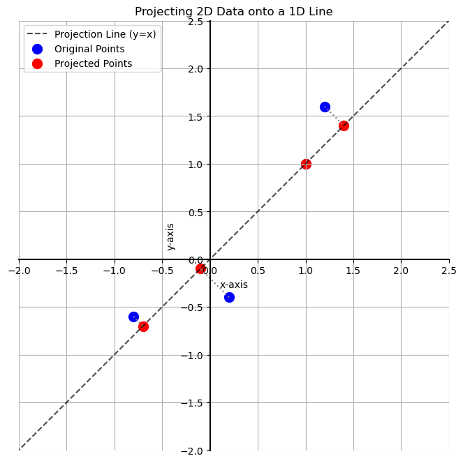

# Dimensionality Reduction and Projection

> ⚠️ The final major topic of this course is **Principal Component Analysis (PCA)**. PCA relies on a few core statistical concepts. If you've not studied statistics before, you can skip the rest of this course for now and come back once you finish the [Probability and Statistics](../../04_probability_and_statistics_for_ml_and_ds/) course.

The goal of PCA is to reduce the number of columns (the dimensions) of a dataset while preserving as much of the original information as possible. In short, PCA makes a dataset "skinnier" by intelligently combining features.

### Why Reduce Dimensions?
1.  **Manageability:** Real-world datasets can have hundreds or thousands of features. Reducing the number of columns makes the data easier to work with, store, and model.
2.  **Visualization:** It's impossible to visualize data in more than three dimensions. By reducing a high-dimensional dataset to just two or three "principal components," we can create meaningful scatter plots to look for patterns.

Simply deleting columns is a bad approach because we lose all the valuable information they contained. PCA is designed to address this by **projecting** the data into a lower-dimensional space in a way that retains the most important information.

## The Concept of Projection

Projection is the process of moving data points from a higher-dimensional space onto a lower-dimensional one (like a line or a plane).

Imagine we have a simple 2D dataset and we want to project it onto the line defined by the equation `y = x`. This means we want to find the "shadow" that each point casts on that line.



## The Math of Projection

How do we calculate the location of these new, projected points? The process uses the dot product and the norm.

To project a matrix of data `A` onto the direction given by a vector `v`, we use the following formula:

```math
A_{proj} = A \cdot \frac{v}{||v||_2}
```
<br>

Let's break this down:

1.  **Normalize the Direction Vector:** We first divide the vector $v$ by its L2-norm $||v||_2$. This creates a **unit vector** that points in the same direction but has a length of 1. This is crucial because it ensures our projection only changes the position of the points, not their scale.

2.  **Take the Dot Product:** We then take the dot product of our data matrix $A$ with this new unit vector. This calculates the new, 1-dimensional coordinates for each of our data points along the projection line.

For our 2D data and the projection line $y=x$ (defined by the vector $v = [1, 1]$), we have successfully reduced our dataset from a table with **two columns** (x and y coordinates) to a single vector with **one column** (the distance along the line).

## Generalizing the Projection

We can project our data onto multiple vectors at once. Projecting onto two vectors is the same as projecting onto the **plane** that those vectors span.

To do this, we simply create a matrix `V` where each column is one of our (normalized) direction vectors. The final projection formula is an elegant matrix multiplication:

```math
A_p = A \cdot V
```
<br>

* If $A$ is an $r x c$ matrix (r rows, c columns)
* And $V$ is a $c x k$ matrix (c rows, k new dimensions)
* The resulting projected matrix $A_p$ will be $r x k$.

The data now has the same number of rows but has been reduced from $c$ dimensions to $k$ dimensions.

The key question now is: how do we pick the best vectors or the best line to project onto? That is what PCA will help us determine.

---

**Next:** [Motivating Principal Component Analysis (PCA)](./02_motivating_pca.md)