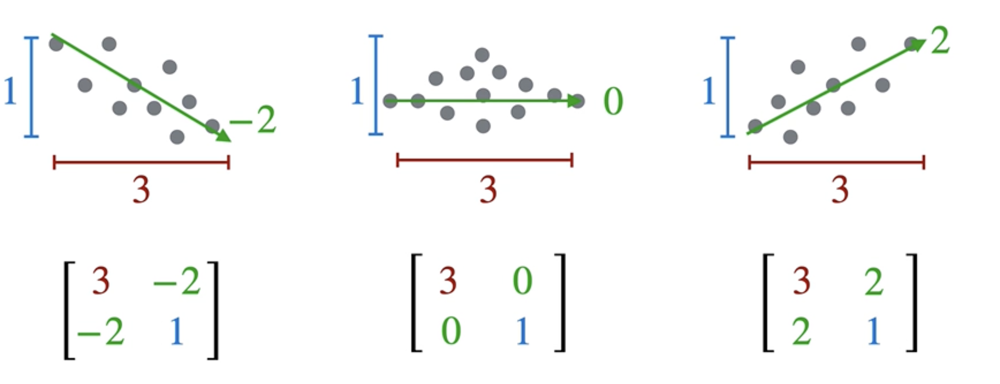
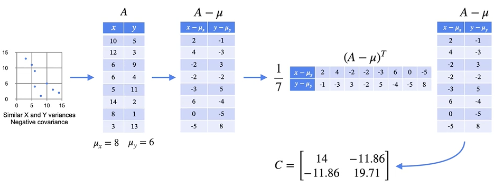
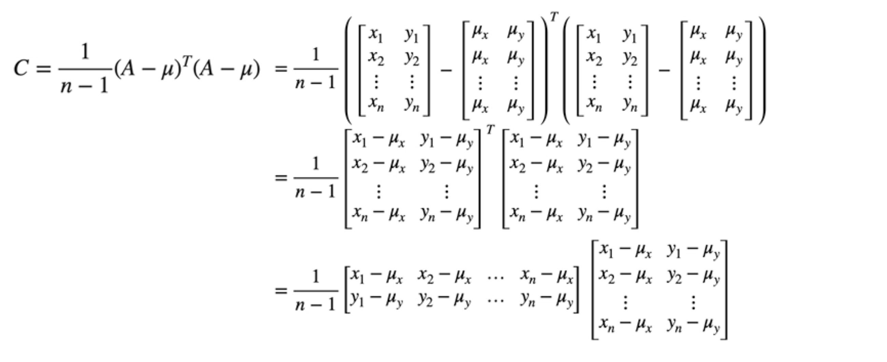

# Covariance Matrix

We've learned about variance (how a single variable is spread out) and covariance (how two variables change together). The **covariance matrix** is a powerful tool that neatly organizes all these measures into a single grid.

It provides a complete summary of the relationships between all pairs of variables in your dataset.

## Motivating the Covariance Matrix

Consider the three datasets below. If we were to calculate the variance for each, we would find that the x-variance and y-variance are roughly the same for all three plots. However, it's clear that the underlying relationships are completely different.

This is where the covariance matrix shines. It captures not only the individual spread of each variable but also the direction of their relationship.

## Constructing the Covariance Matrix

For a dataset with two variables, `x` and `y`, the covariance matrix `C` is a 2x2 matrix built as follows:

1.  **Calculate the components:**
* Variance of x: $\text{Var}(x)$
* Variance of y: $\text{Var}(y)$
* Covariance of x and y: $\text{Cov}(x, y)$  

2.  **Build the matrix:**  

$$
C = \begin{bmatrix}
\text{Var}(x) & \text{Cov}(x, y) \\
\text{Cov}(y, x) & \text{Var}(y)
\end{bmatrix}
$$

A key property is that the matrix is **symmetric**, meaning $\text{Cov}(x, y) = \text{Cov}(y, x)$.

Furthermore, the variance of a variable with itself is just its variance: $\text{Var}(x) = \text{Cov}(x, x)$. This means we can think of the covariance matrix as a generalized grid of covariances:  

$$
C = \begin{bmatrix}
\text{Cov}(x, x) & \text{Cov}(x, y) \\
\text{Cov}(y, x) & \text{Cov}(y, y)
\end{bmatrix}
$$

## The Matrix Notation Formula

While we can calculate each component individually, there is a very efficient and elegant way to compute the entire covariance matrix at once using matrix operations.

Given a data matrix `A` with `n` rows (observations) and `c` columns (features):

1.  **Center the data:** Calculate the mean of each column and subtract it from every element in that column. Let's call this centered matrix `A_centered`.
2.  **Calculate the product:** The covariance matrix `C` is then given by the formula:  

$$
C = \frac{1}{n-1} A_{centered}^T \cdot A_{centered}
$$

Note that this matrix multiplication gives us the values of the 2x2 covariance matrix, because the dot products of the rows of the first matrix and the columns of the second matrix are the actual formulas of the 4 values of the matrix 

$$
\begin{bmatrix}
\text{Var}(x) & \text{Cov}(x, y) \\
\text{Cov}(y, x) & \text{Var}(y)
\end{bmatrix}
$$

## A Worked Example

Let's walk through this with a real example.

1. First, we write our data on a table of two columns, one for each feature.
2. Then we calculate the mean of each column:  
* $\mu_x = 8$
* $\mu_y = 6$

3. Then we center the data by subtracting the mean from each column.
4. Then we we transpose the centered matrix.
5. Finally we perform the matrix multiplication and scale.

The result of this calculation is the final 2x2 covariance matrix for our dataset. 

This process extends to any number of features; a dataset with 3 features would produce a 3x3 covariance matrix, and so on. This matrix operation is a fundamental building block for PCA.

---

**Next:** [Principal Component Analysis - An Overview](./05_pca--overview.md)
