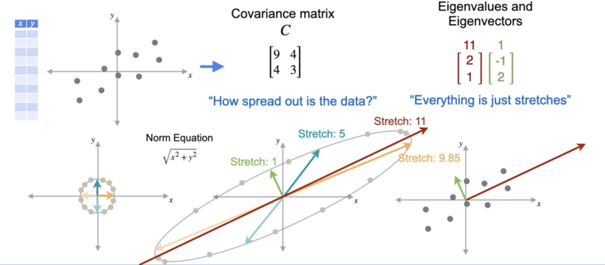

# PCA - Why It Works (The Intuition)

We've established that PCA finds the line that maximizes the variance of our projected data. But *why* does the process of finding the eigenvectors of the covariance matrix accomplish this?

The intuition lies in viewing the **covariance matrix itself as a linear transformation**.

Let's start with our centered data and its covariance matrix:

$$
C = \begin{bmatrix}
9 & 4 \\
4 & 3
\end{bmatrix}
$$

What does this matrix *do* to the space? A great way to find out is to see how it transforms a simple shape, like a circle of vectors with a radius of 1.

The visualization reveals the core secret of PCA. The covariance matrix `C` transforms a circle of direction vectors into an ellipse.

* The **axes of this ellipse** represent the directions of maximum and minimum "stretch."
* These axes are precisely the **eigenvectors** of the covariance matrix.
* The **length** of each axis of the ellipse is determined by the corresponding **eigenvalue**. The eigenvector with the largest eigenvalue points along the major (longest) axis of the ellipse.

### Why This Maximizes Variance

The transformation `C` characterizes the spread of our original data. The direction in which `C` stretches space the *most* (the major axis of the ellipse) must be the direction of the highest variance in our data.

Any vector along the direction of the first eigenvector (e.g., `v = [2, 1]`) will be stretched by a factor of its eigenvalue, `λ₁ = 11`. Any vector along the second eigenvector (`v = [-1, 2]`) will be stretched by a factor of its eigenvalue, `λ₂ = 1`. Any other vector will be stretched by a factor somewhere in between.

Therefore, to preserve the most variance, we must choose to project our data onto the eigenvector associated with the **largest eigenvalue**. This is the direction of maximum stretch, and therefore, maximum variance. That is why PCA works.

---

**Next:** [PCA - The Mathematical Formulation](./07_pca--mathematical_formulation.md)