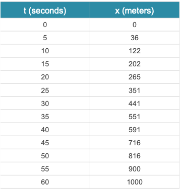
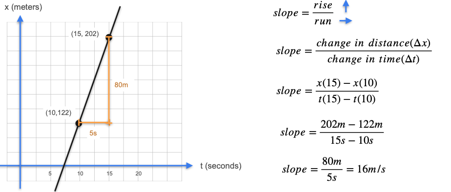
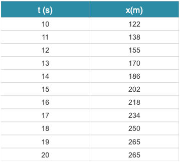

# Introduction to Derivatives

When we think of a **derivative**, the first thing that often comes to mind is **velocity**.

If a car travels 100 kilometers in one hour, its *average* velocity was 100 km/h. However, the car's velocity is not constant—it speeds up, slows down, and maybe even stops. The key question is: what is the car's velocity at a single, specific instant in time?

This "instantaneous rate of change" is precisely what a derivative measures.

## The Broken Speedometer Problem

Imagine you are in a car, but the speedometer is broken. You do, however, have an app that tells you the total distance you have traveled. You record this distance every five seconds for one minute.

**Question 1:** Is the car moving at a constant speed?

No. For example, between 10 and 15 seconds (a 5-second interval), the car traveled 80 meters. But between 15 and 20 seconds (also a 5-second interval), it only traveled 63 meters. The car was moving faster during the first interval.

**Question 2:** Can we find the *exact* velocity at `t = 12.5` seconds?

No. With this data, we can only calculate the *average* velocity over an interval. We don't know what happened *within* that interval at the specific moment of 12.5 seconds.

## Estimating Velocity with Slope

While we can't find the exact velocity, we can make a very good estimate by calculating the **average velocity** over a small interval.

The formula for average velocity is `change in distance / change in time`. This is mathematically identical to the formula for the **slope** of a line: `rise / run`.

Let's estimate the velocity at `t = 12.5s` by calculating the average velocity over the interval from 10s to 15s.

The average velocity in the interval from 10 to 15 seconds is **16 m/s**. This is a reasonable first estimate for the instantaneous velocity at `t = 12.5s`.

## Improving the Estimate

Could we do better? Yes, if we had more granular data. Let's say we now have measurements for every second.

Now we can calculate the average velocity over a much smaller interval that still contains `t = 12.5s`: the interval from **12 seconds to 13 seconds**.

* **Distance at 13s:** 170 m
* **Distance at 12s:** 155 m
* **Change in distance:** 15 m
* **Change in time:** 1 s
* **New Average Velocity:** 

$$
\frac{15 \text{ m}}{1 \text{ s}} = 15 \text{ m/s} 
$$

This is a much better estimate for the instantaneous velocity at `t = 12.5s`.

## The Derivative

This process reveals the core idea of a derivative. To find the *exact* instantaneous rate of change at a point, we just keep making the interval smaller and smaller, getting closer and closer to zero.

❗️ The **derivative** of a function at a point is the **limit** of the average rate of change as the length of the interval around that point approaches zero.

Geometrically, as the interval shrinks, the **secant line** connecting the two endpoints gets closer and closer to the **tangent line** at that single point. The derivative is the slope of this tangent line.

---

**Next:** [Derivatives and Tangents](./02_derivatives_and_tangents.md)