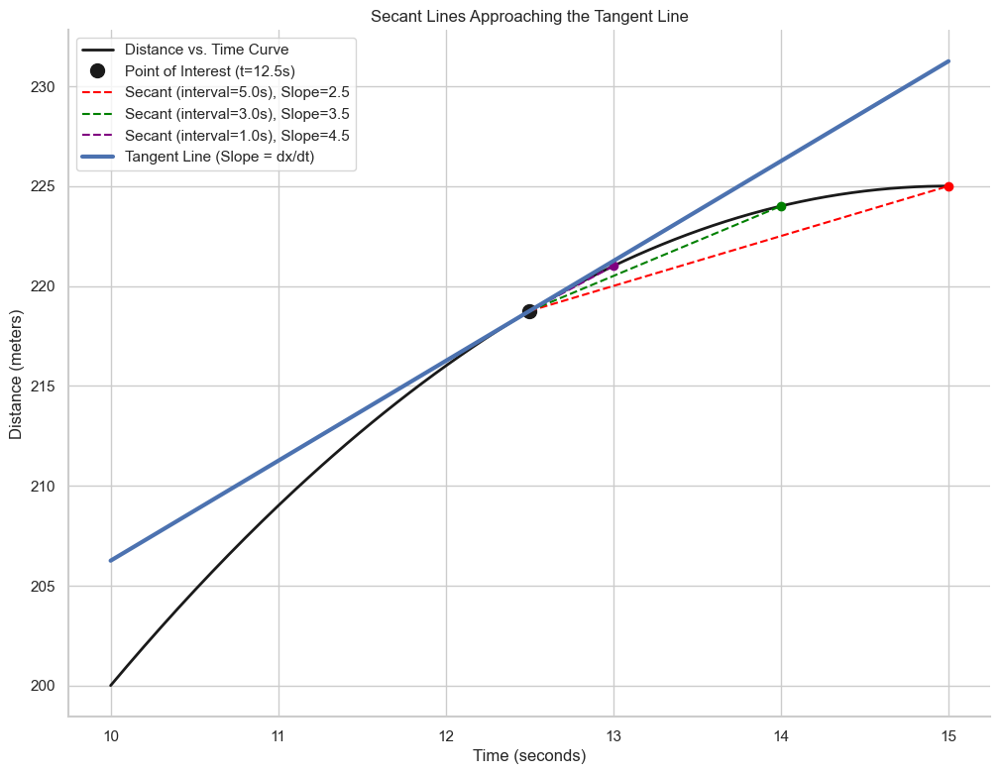

# Derivatives and Tangents

In the previous lesson, we learned how to estimate an instantaneous velocity by calculating the average velocity over a very small interval. This average velocity is the slope of the **secant line** that connects the two endpoints of the interval.

To find the *exact* instantaneous velocity at a single point, we need to see what happens as the interval around that point gets smaller and smaller, approaching zero.

Geometrically, as the interval shrinks, the secant line "pivots" and gets closer and closer to the **tangent line** at that single point. The slope of this tangent line is the **instantaneous rate of change**, which is the **derivative**.

Let's visualize this process.

## The Formal Definition of the Derivative

The process we just visualized is captured formally by the concept of a **limit**. The derivative of a function `f(x)` with respect to `x` is the limit of the slope of the secant lines as the interval `h` (or `Δt` in our example) approaches zero.

This instantaneous rate of change is denoted as **`dx/dt`** (read as "the derivative of x with respect to t"). It represents a tiny change in distance (`dx`) divided by a tiny change in time (`dt`).

**The derivative of a function at a point is the slope of the tangent line at that point.**

---

**Next:** 