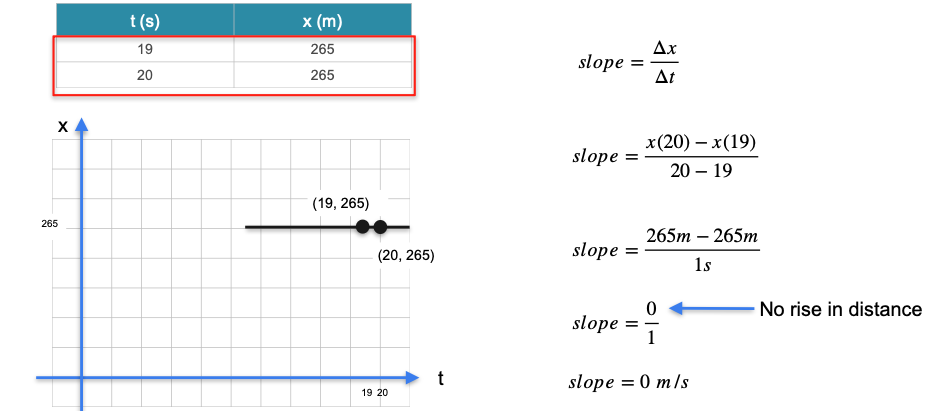
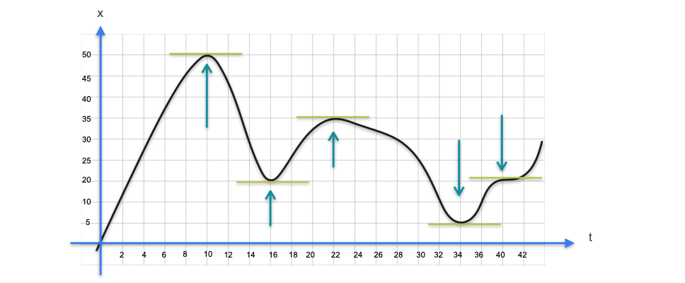

# Slopes, Maxima, and Minima

Now that we know what a derivative is, let's explore one of its most powerful properties: helping us find the peaks and valleys of a function.

Let's revisit our car example. Imagine we have data for the interval between 19 and 20 seconds:
* **Distance at 19s:** 265 meters
* **Distance at 20s:** 265 meters

Since the distance did not change, the average velocity must be zero. Let's confirm this by calculating the slope of the secant line between these two points.

* **Change in distance (Rise):** $265 - 265 = 0$ meters
* **Change in time (Run):** $20 - 19 = 1$ second
* **Slope (Average Velocity):** $\frac{0 \text{ m}}{1 \text{ s}} = 0 \text{ m/s}$

A slope of zero corresponds to a **horizontal line**.

---

## Maxima and Minima

The fact that a zero slope corresponds to a horizontal tangent line is incredibly important. Consider a more complex trajectory where a car moves forward, stops, moves backward, etc.

At every point where the car stops (its velocity is zero), the tangent line to the distance-time graph must be horizontal. These are the "turning points" of the graph.

Notice something interesting: the point where the car was **farthest** from its starting point (t=10, the **maximum** distance) is also a point where the tangent line is horizontal. Similarly, local minimums also occur where the tangent is horizontal.

This gives us a fundamental rule of calculus:

> To find the maximum or minimum value of a function, you must look for the points where its **derivative is equal to zero**.