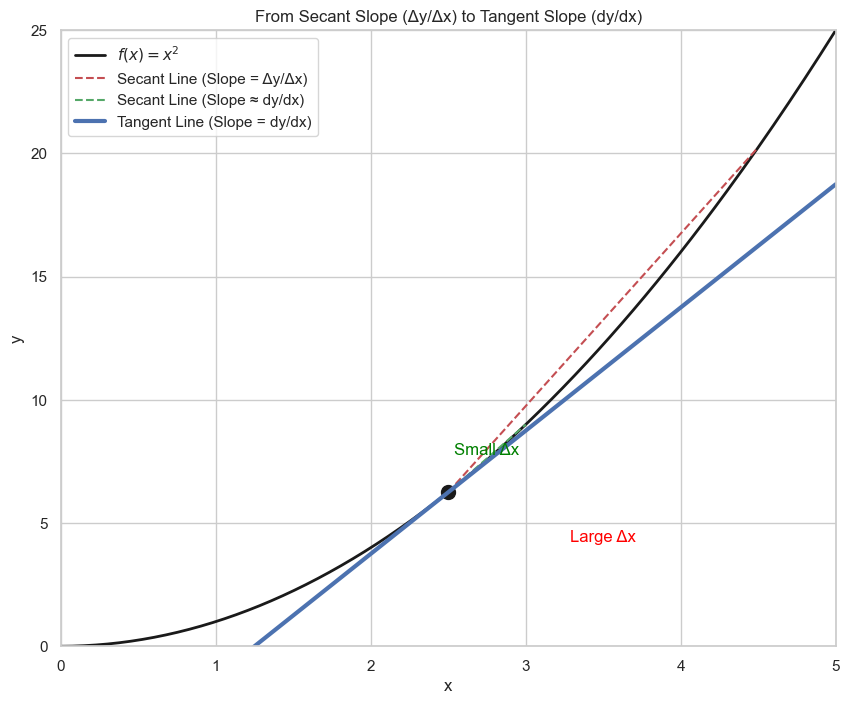

# Derivatives and Their Notation

Like any language, mathematics has its own grammar and notation for expressing concepts. In this lesson, we'll learn the two primary ways to write the derivative.

Recall that we calculated the slope of a **secant line** (the average rate of change) over an interval as:

```math
\text{Slope} = \frac{\Delta y}{\Delta x} = \frac{\text{change in y}}{\text{change in x}}
```
<br>

To find the slope of the **tangent line** at a single point (the derivative), we took the limit as this interval became infinitesimally small. This is the foundation for the first and most descriptive notation for the derivative.



## The Two Main Notations

Let's say we have a function $y = f(x)$. There are two common ways to write its derivative.

### 1. Leibniz's Notation
This notation is the most descriptive. It writes the derivative as:

$$
\frac{dy}{dx}
$$

You can read this as "the derivative of y with respect to x." The `d` represents an infinitesimally small change (a "delta"), making it a direct evolution from the secant slope formula $\frac{\Delta y}{\Delta x}$.

Sometimes, you will see it written as an operator acting on the function:

$$ \frac{d}{dx}f(x) $$

This is read as "the derivative with respect to x of the function f(x)."

### 2. Lagrange's Notation
This notation is simpler and more compact. It uses a prime symbol (`'`) to denote the derivative.

$$ f'(x) $$

This is read as "f prime of x" and it means "the derivative of the function f at the point x."

Both notations mean the exact same thing. We will use them interchangeably in this course, typically choosing the one that is most convenient for the context.