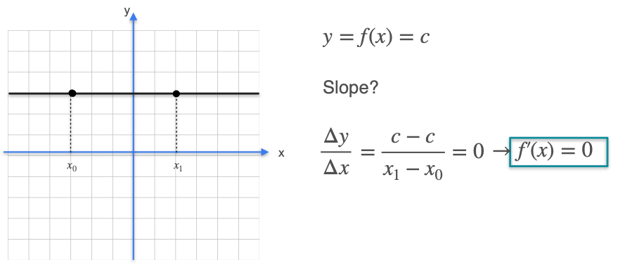
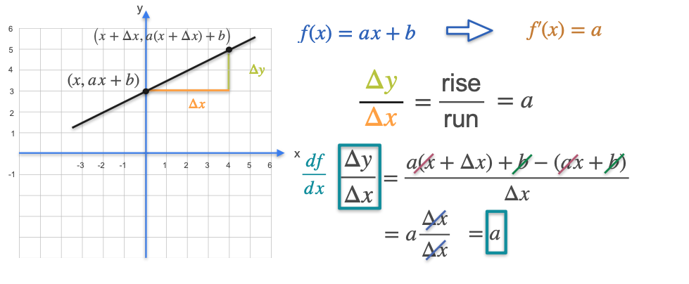

# Some Common Derivatives - Lines

Our goal is to be able to calculate the derivatives of the most common functions. The simplest functions to start with are lines.

### Case 1: The Constant Function (Horizontal Line)

A constant function is a horizontal line with the equation $f(x) = c$, where `c` is some constant.

The derivative of a function at a point is the slope of the tangent line at that point. For a horizontal line, the tangent line at any point is the line itself. The slope of a horizontal line is always **zero**.

We can see this from the slope formula, $\frac{\Delta y}{\Delta x}$. Since the y-value is always `c`, the change in y ($\Delta y$) is always $c - c = 0$. Therefore, the slope is always 0.

**Rule:** The derivative of a constant function is always **0**. 

$$ \frac{d}{dx}(c) = 0 $$

### Case 2: The General Linear Function

Now let's consider any line that is not horizontal. Its equation is $f(x) = ax + b$, where `a` is the slope and `b` is the y-intercept.

Just like with the constant function, the tangent line to a straight line at any point is the line itself. Therefore, the slope of the tangent line is always the slope of the original line, which is `a`.

> **Rule:** The derivative of a linear function $ax+b$ is its slope, **a**.
> > 
> $ \frac{d}{dx}(ax+b) = a $

We can prove this algebraically. Let's find the slope between two points on the line: `x` and `x + Δx`.

* **Point 1:** $(x, ax+b)$
* **Point 2:** $(x+\Delta x, a(x+\Delta x)+b)$

$$ \text{Slope} = \frac{\Delta y}{\Delta x} = \frac{(a(x+\Delta x)+b) - (ax+b)}{\Delta x} $$
$$ = \frac{ax + a\Delta x + b - ax - b}{\Delta x} = \frac{a\Delta x}{\Delta x} = a $$
Since the slope is always `a` no matter how small `Δx` is, the derivative is `a`.

