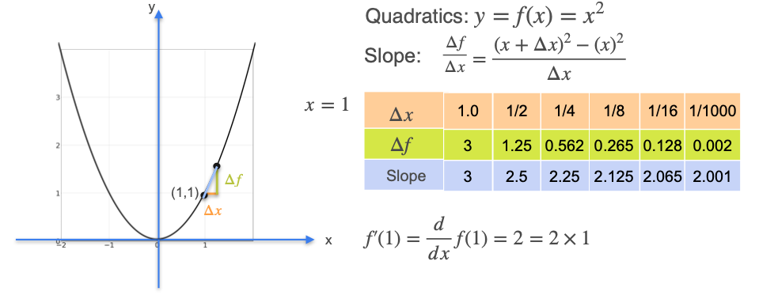

# Some Common Derivatives - Quadratics

Now that we've mastered the derivatives of lines, let's look at a slightly more complex function: a quadratic. The simplest quadratic is the parabola with the equation $f(x) = x^2$.

Unlike a straight line, the slope of a parabola is constantly changing. To the left of the y-axis, the slopes of the tangent lines are negative, and to the right, they are positive.

To find the derivative, we will use the same process as before: we will calculate the slope of the secant lines over progressively smaller intervals to see what value the slope approaches in the limit.

## A Numerical Example: Finding the Slope at x = 1

Let's find the derivative (the slope of the tangent line) for the function $f(x) = x^2$ at the specific point **x = 1**. At this point, $y = 1^2 = 1$.

We will start with a large interval, `Δx = 1`, and calculate the slope of the secant line. Then we will shrink `Δx` and see where the slope converges.

* **For Δx = 1:**
    * The interval is from `x=1` to `x=2`.
    * $\Delta y = f(2) - f(1) = 2^2 - 1^2 = 4 - 1 = 3$
    * **Slope** = $\frac{\Delta y}{\Delta x} = \frac{3}{1} = 3$  

* **For Δx = 0.5:**
    * The interval is from `x=1` to `x=1.5`.
    * $\Delta y = f(1.5) - f(1) = 1.5^2 - 1^2 = 2.25 - 1 = 1.25$
    * **Slope** = $\frac{\Delta y}{\Delta x} = \frac{1.25}{0.5} = 2.5$  

* **For Δx = 0.25:**
    * The interval is from `x=1` to `x=1.25`.
    * $\Delta y = f(1.25) - f(1) = 1.25^2 - 1^2 \approx 1.5625 - 1 = 0.5625$
    * **Slope** = $\frac{\Delta y}{\Delta x} = \frac{0.5625}{0.25} = 2.25$  

As we make the interval smaller and smaller, the slope seems to be approaching **2**.

* `Δx = 0.001` ➔ **Slope = 2.001**

It seems the exact slope of the tangent line at `x=1` is **2**.

## The Formal Proof

We can prove this result for any point `x` using algebra. We want to find the limit of the slope as `Δx` approaches zero.

$$ \text{Slope} = \frac{\Delta f}{\Delta x} = \frac{f(x+\Delta x) - f(x)}{\Delta x} $$

Since our function is $f(x) = x^2$:

$$ = \frac{(x+\Delta x)^2 - x^2}{\Delta x} $$

Now, we expand the squared term:

$$ = \frac{(x^2 + 2x\Delta x + (\Delta x)^2) - x^2}{\Delta x} $$

The $x^2$ terms cancel out:

$$ = \frac{2x\Delta x + (\Delta x)^2}{\Delta x} $$

We can now divide the numerator by `Δx`:

$$ = 2x + \Delta x $$

Finally, we take the limit as `Δx` goes to zero. The term `Δx` becomes zero, and we are left with:

$$ \lim_{\Delta x \to 0} (2x + \Delta x) = 2x $$

**Rule (The Power Rule for x²):** The derivative of $f(x) = x^2$ is **$f'(x) = 2x$**.  

This confirms our numerical finding. At `x=1`, the derivative is $2(1) = 2$.

---

**Next:** [Some Common Derivatives - Higher Degree Polynomials](./07_derivatives_of_higher_degree_polynomials.md)