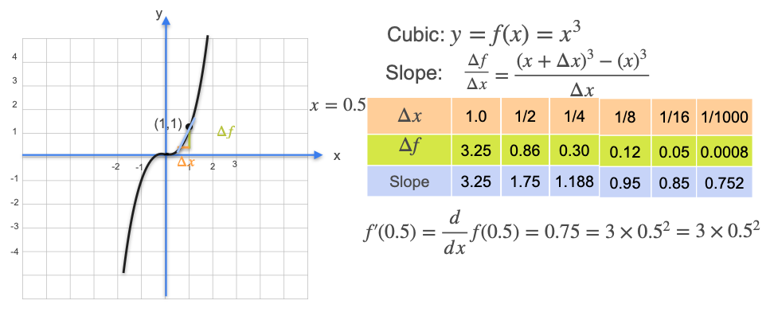

# Some Common Derivatives - Higher Degree Polynomials

Now that we've found the derivatives for lines and quadratics, let's move on to a cubic function. The simplest is the function $f(x) = x^3$.

We will follow the exact same process as before:
1.  First, we'll build our intuition by numerically estimating the slope of the tangent line at a specific point (`x = 0.5`) by using progressively smaller intervals.
2.  Then, we'll use algebra to find the general formula for the derivative of $x^3$.

## A Numerical Example: Finding the Slope at x = 0.5

Let's find the derivative for $f(x) = x^3$ at the point **x = 0.5**. At this point, $y = (0.5)^3 = 0.125$.

We will calculate the slope of the secant line over shrinking intervals (`Δx`) to see where the slope converges.

* **For Δx = 1.0:**
    * Interval is `[0.5, 1.5]`. $\Delta y = f(1.5) - f(0.5) = 3.375 - 0.125 = 3.25$
    * **Slope** = $3.25 / 1.0 = 3.25$  

* **For Δx = 0.5:**
    * Interval is `[0.5, 1.0]`. $\Delta y = f(1.0) - f(0.5) = 1.0 - 0.125 = 0.875$
    * **Slope** = $0.875 / 0.5 = 1.75$  

* **For Δx = 0.25:**
    * Interval is `[0.5, 0.75]`. $\Delta y = f(0.75) - f(0.5) \approx 0.4218 - 0.125 = 0.2968$
    * **Slope** = $0.2968 / 0.25 \approx 1.187$  

As we continue, the slope appears to be converging to **0.75**.

* `Δx = 0.001` ➔ **Slope ≈ 0.752**

## The Formal Proof

We can prove this result for any point `x` using the limit definition of the derivative.

$$ \text{Slope} = \frac{\Delta f}{\Delta x} = \frac{f(x+\Delta x) - f(x)}{\Delta x} $$

Since our function is $f(x) = x^3$:

$$ = \frac{(x+\Delta x)^3 - x^3}{\Delta x} $$

We expand the cubic term $(x+\Delta x)^3$:

$$ = \frac{(x^3 + 3x^2\Delta x + 3x(\Delta x)^2 + (\Delta x)^3) - x^3}{\Delta x} $$

The $x^3$ terms cancel out:

$$ = \frac{3x^2\Delta x + 3x(\Delta x)^2 + (\Delta x)^3}{\Delta x} $$

We can now divide the numerator by `Δx`:

$$ = 3x^2 + 3x\Delta x + (\Delta x)^2 $$

Finally, we take the limit as `Δx` goes to zero. Any term with a `Δx` in it becomes zero:

$$ \lim_{\Delta x \to 0} (3x^2 + 3x\Delta x + (\Delta x)^2) = 3x^2 $$

**Rule (The Power Rule for x³):** The derivative of $f(x) = x^3$ is **$f'(x) = 3x^2$**.

This confirms our numerical finding. At `x=0.5`, the derivative is $3(0.5)^2 = 3(0.25) = 0.75$.