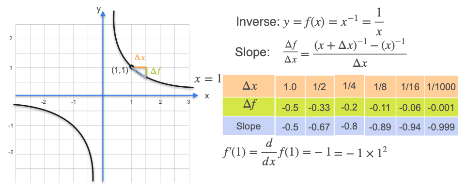

# Some Common Derivatives - Other Power Functions

Now that we've found the derivatives for polynomials, let's look at a function with a negative exponent: $f(x) = \frac{1}{x}$, which can also be written as $f(x) = x^{-1}$.

This function is a hyperbola. We will follow the same process as before: first, we will numerically estimate the slope of the tangent line at a point (`x=1`), and then we will find the general formula using algebra.

## A Numerical Example: Finding the Slope at x = 1

Let's find the derivative for $f(x) = x^{-1}$ at the point **x = 1**. At this point, $y = 1^{-1} = 1$.

We will calculate the slope of the secant line over shrinking intervals (`Δx`) to see where the slope converges.

* **For Δx = 1.0:**
    * Interval is `[1, 2]`. $\Delta y = f(2) - f(1) = \frac{1}{2} - 1 = -0.5$
    * **Slope** = $-0.5 / 1.0 = -0.5$  

* **For Δx = 0.5:**
    * Interval is `[1, 1.5]`. $\Delta y = f(1.5) - f(1) = \frac{1}{1.5} - 1 \approx 0.667 - 1 = -0.333$
    * **Slope** = $-0.333 / 0.5 \approx -0.67$  

* **For Δx = 0.25:**
    * Interval is `[1, 1.25]`. $\Delta y = f(1.25) - f(1) = \frac{1}{1.25} - 1 = 0.8 - 1 = -0.2$
    * **Slope** = $-0.2 / 0.25 = -0.8$

As we make the interval smaller and smaller, the slope seems to be approaching **-1**.

* `Δx = 0.001` ➔ **Slope ≈ -0.999**

It seems the exact slope of the tangent line at `x=1` is **-1**.

## The Formal Proof

We can prove this result for any point `x` using the limit definition of the derivative.

$$ \text{Slope} = \frac{\Delta f}{\Delta x} = \frac{\frac{1}{x+\Delta x} - \frac{1}{x}}{\Delta x} $$

To simplify the numerator, we find a common denominator:

$$ = \frac{\frac{x - (x+\Delta x)}{x(x+\Delta x)}}{\Delta x} $$

The `x` terms in the numerator cancel out:

$$ = \frac{\frac{-\Delta x}{x(x+\Delta x)}}{\Delta x} $$

We can now cancel the `Δx` from the numerator and the denominator:

$$ = \frac{-1}{x(x+\Delta x)} = \frac{-1}{x^2 + x\Delta x} $$

Finally, we take the limit as `Δx` goes to zero. The term `xΔx` becomes zero:

$$ \lim_{\Delta x \to 0} \frac{-1}{x^2 + x\Delta x} = -\frac{1}{x^2} $$

The derivative of $f(x) = \frac{1}{x} = x^{-1}$ is **$f'(x) = -\frac{1}{x^2} = -1 \cdot x^{-2}$**.

This confirms our numerical finding. At `x=1`, the derivative is $-1/(1)^2 = -1$.

## The General Power Rule

Let's look at the pattern from the derivatives we've calculated so far:

| Function | Derivative | In Exponent Form |
| :--- | :--- | :--- |
| $f(x) = x^2$ | $f'(x) = 2x$ | $2x^1$ |
| $f(x) = x^3$ | $f'(x) = 3x^2$| $3x^2$ |
| $f(x) = x^{-1}$| $f'(x) = -1/x^2$| $-1x^{-2}$|

The pattern is clear and it works for any power function.

**The General Power Rule:** The derivative of $f(x) = x^n$ is **$f'(x) = nx^{n-1}$**.

1.  Bring the original exponent `n` down as a multiplicative factor.
2.  Subtract one from the original exponent to get the new exponent.

**Examples:**
* If $f(x) = x^{100}$, then $f'(x) = 100x^{99}$.
* If $f(x) = x^{-100}$, then $f'(x) = -100x^{-101}$.