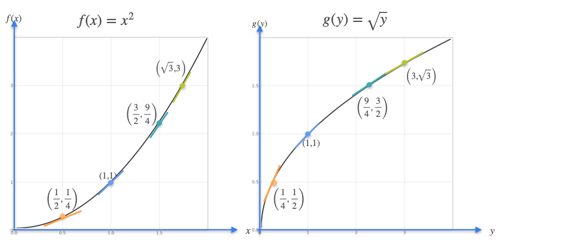
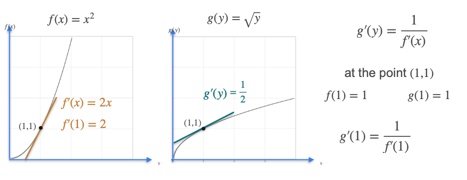
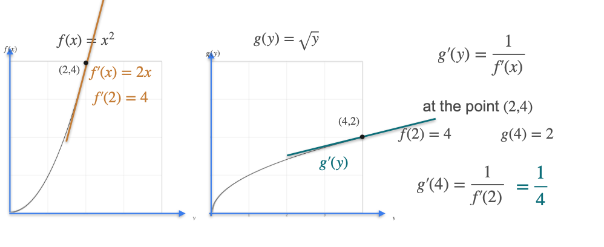

# The Inverse Function and Its Derivative

An **inverse function** is a function that "undoes" the action of another function. If a function `f` takes an input `x` and produces an output `y`, then its inverse function, denoted as **$f^{-1}$**, takes `y` as input and produces `x` as output.

* If $f(a) = b$, then $f^{-1}(b) = a$.
* Applying a function and then its inverse returns the original input: $f^{-1}(f(x)) = x$.

**A Classic Example:**
* Let our function be $f(x) = x^2$. It takes a number and squares it.
* The function that "undoes" squaring is the square root. So, its inverse is $g(x) = f^{-1}(x) = \sqrt{x}$.

*(Note: To make this a true one-to-one function, we will only consider non-negative numbers for x).*

Geometrically, a function and its inverse are **reflections of each other across the line y = x**. If the point `(a, b)` is on the graph of `f`, then the point `(b, a)` will be on the graph of $f^{-1}$.

---

## The Derivative of an Inverse Function

There is a beautiful and simple relationship between the derivative of a function and the derivative of its inverse.

> **Rule:** The derivative of an inverse function is the **reciprocal** of the derivative of the original function, evaluated at the corresponding point.
> > 
> $ (f^{-1})'(y) = \frac{1}{f'(x)} $

Let's explore this with our example functions, $f(x) = x^2$ and its inverse $g(y) = \sqrt{y}$. We already know that $f'(x) = 2x$.

### Example 1: At the point (1, 1)
* The point `(1, 1)` exists on both graphs since $f(1) = 1^2 = 1$ and $g(1) = \sqrt{1} = 1$.
* The slope of the tangent to $f(x)$ at $x=1$ is $f'(1) = 2(1) = 2$.
* According to our rule, the slope of the tangent to $g(y)$ at the corresponding point ($y=1$) should be the reciprocal: $g'(1) = \frac{1}{f'(1)} = \frac{1}{2}$.
  

### Example 2: At the points (2, 4) and (4, 2)
* We know that $f(2) = 2^2 = 4$. This gives us the point `(2, 4)` on the graph of $f(x)$.
* The corresponding point on the inverse function's graph is `(4, 2)`, since $g(4) = \sqrt{4} = 2$.
* The slope of the tangent to $f(x)$ at $x=2$ is $f'(2) = 2(2) = 4$.
* Therefore, the slope of the tangent to $g(y)$ at the corresponding point ($y=4$) must be the reciprocal: $g'(4) = \frac{1}{f'(2)} = \frac{1}{4}$.

