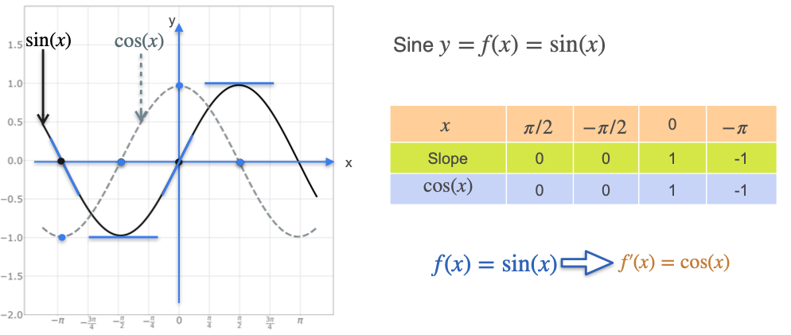
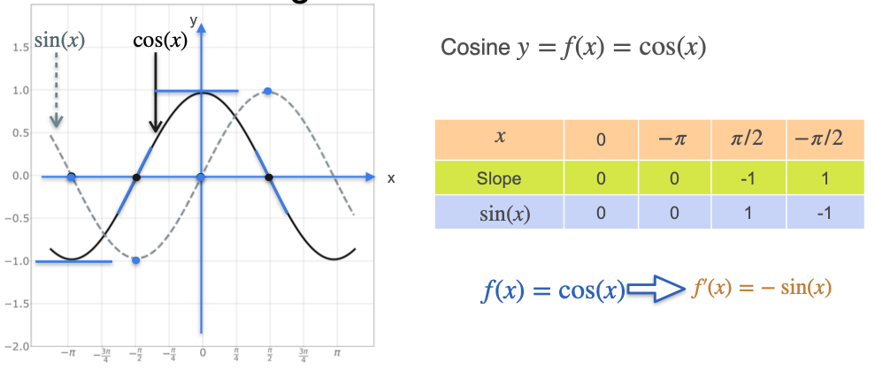
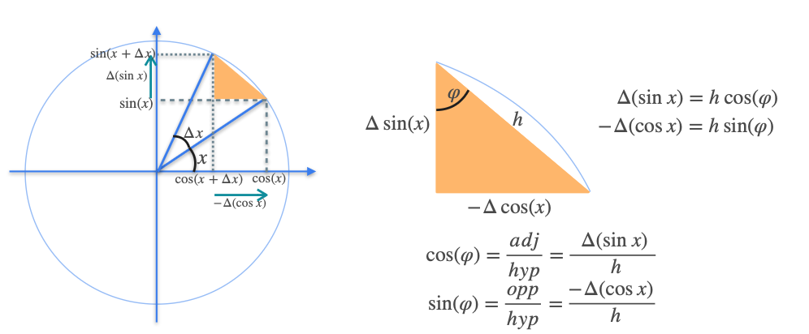
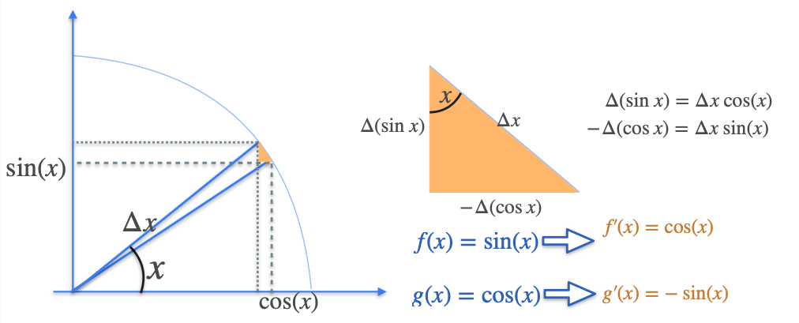

# Some Common Derivatives - Trigonometric Functions

Let's now explore the derivatives of the trigonometric functions, starting with sine and cosine. We will find that they share a very simple and beautiful relationship.

### The Derivative of Sine
Let's look at the graph of $f(x) = \sin(x)$ and consider the slope of its tangent line at several key points:
* At $x = -\pi/2$ and $x = \pi/2$, the function is at its minimum and maximum. The tangent lines are horizontal, so the **slope is 0**.
* At $x = 0$, the function is rising most steeply. The slope of the tangent line is **1**.
* At $x = \pi$, the function is falling most steeply. The slope of the tangent line is **-1**.

Now, let's compare these slopes to the *values* of the function $g(x) = \cos(x)$ at the same points. We find a perfect match. This is no coincidence.

**Rule:** The derivative of $\sin(x)$ is **$\cos(x)$**.
 
$$ \frac{d}{dx}(\sin x) = \cos x $$

### The Derivative of Cosine
We can do the same analysis for $f(x) = \cos(x)$.
* At $x=0$ and $x=\pi$, the tangent lines are horizontal, so the **slope is 0**.
* At $x = \pi/2$, the function is falling most steeply. The slope of the tangent is **-1**.
* At $x = -\pi/2$, the function is rising most steeply. The slope of the tangent is **1**.

If we compare these slopes to the values of $\sin(x)$, we see they are the exact opposites.

**Rule:** The derivative of $\cos(x)$ is **$-\sin(x)$**.

$$ \frac{d}{dx}(\cos x) = -\sin x $$

## Geometric Intuition from the Unit Circle

We can understand why these rules are true by looking at the **unit circle**.

1.  Consider a point on the unit circle at an angle `x`. Its coordinates are `(cos(x), sin(x))`.
2.  Now, move the angle by a tiny amount, `Δx`. This creates a new point and a very small triangle.
3.  Because the interval `Δx` is infinitesimally small, the hypotenuse of this triangle is approximately equal to the arc length, which is `Δx`.
4.  The angle at the top of this small triangle, `φ`, is approximately equal to the main angle, `x`.
5.  The sides of this triangle represent the change in sine, `Δsin(x)`, and the change in cosine, `-Δcos(x)`.

Using basic trigonometry on this small triangle:
* `cos(φ) ≈ cos(x) = adjacent / hypotenuse = Δsin(x) / Δx`
* `sin(φ) ≈ sin(x) = opposite / hypotenuse = -Δcos(x) / Δx`

As `Δx` approaches zero, `Δsin(x) / Δx` becomes the derivative of sine, and `Δcos(x) / Δx` becomes the derivative of cosine. This gives us our final rules:
* The derivative of `sin(x)` is `cos(x)`.
* The derivative of `cos(x)` is `-sin(x)`.

---

**Next:** [The Meaning of the Exponential (e)](./11_meaning_of_the_exponential.md)