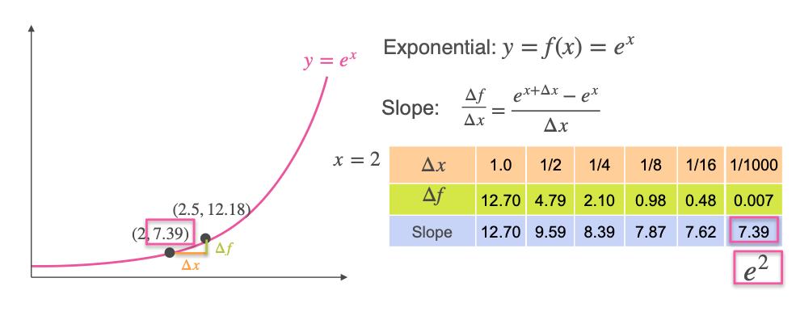

# The Derivative of eˣ

In the previous lesson, we learned about the exponential function, $f(x) = e^x$. This function has a unique and powerful property that makes it fundamental to mathematics and science: **it is its own derivative**.

This means that at any point on the graph of $y = e^x$, the **value** of the function is exactly equal to the **slope of the tangent line** at that same point. As the function's value grows, its rate of growth increases by the exact same amount.

Let's verify this numerically.

## A Numerical Example: Finding the Slope at x = 2

We will find the derivative (the slope of the tangent line) for the function $f(x) = e^x$ at the specific point **x = 2**. At this point, the value of the function is $y = e^2 \approx 7.39$.

We will calculate the slope of the secant line over shrinking intervals (`Δx`) to see if the slope converges to `7.39`.

* **For Δx = 1.0:**
    * Interval is `[2, 3]`. $\Delta y = e^3 - e^2 \approx 20.09 - 7.39 = 12.7$
    * **Slope** = $12.7 / 1.0 = 12.7$
* **For Δx = 0.5:**
    * Interval is `[2, 2.5]`. $\Delta y = e^{2.5} - e^2 \approx 12.18 - 7.39 = 4.79$
    * **Slope** = $4.79 / 0.5 = 9.58$
* **For Δx = 0.25:**
    * Interval is `[2, 2.25]`. $\Delta y = e^{2.25} - e^2 \approx 9.49 - 7.39 = 2.1$
    * **Slope** = $2.1 / 0.25 = 8.4$

As we continue to make the interval smaller, the slope gets closer and closer to **7.39**.
* `Δx = 0.001` ➔ **Slope ≈ 7.39**

This numerically confirms that the slope of the tangent line at `x=2` is indeed $e^2$.

## The Formal Rule

This remarkable property holds true for any point `x`. The tangent at the point $(x, e^x)$ always has a slope of $e^x$.

**Rule:** The derivative of $f(x) = e^x$ is **$f'(x) = e^x$**
 
$$ \frac{d}{dx}(e^x) = e^x $$

---

**Next:** [The Derivative of the Natural Logarithm](./13_derivative_of_natural_logarithm.md)