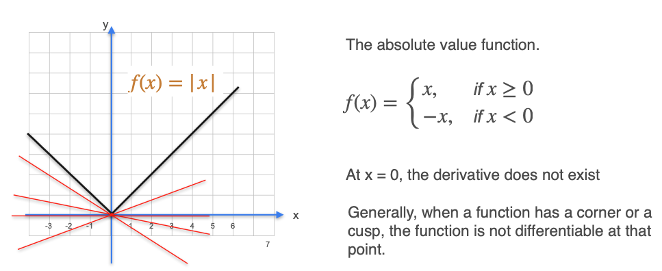
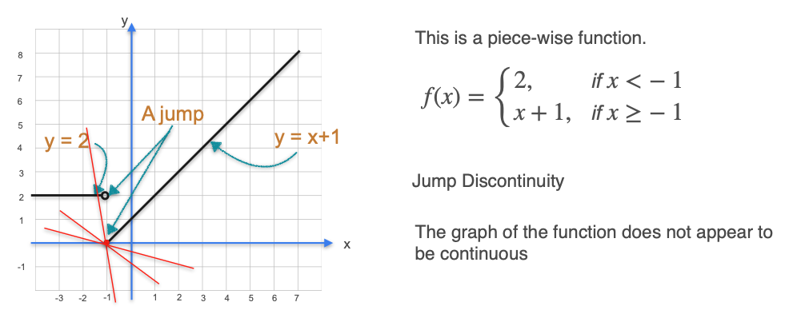
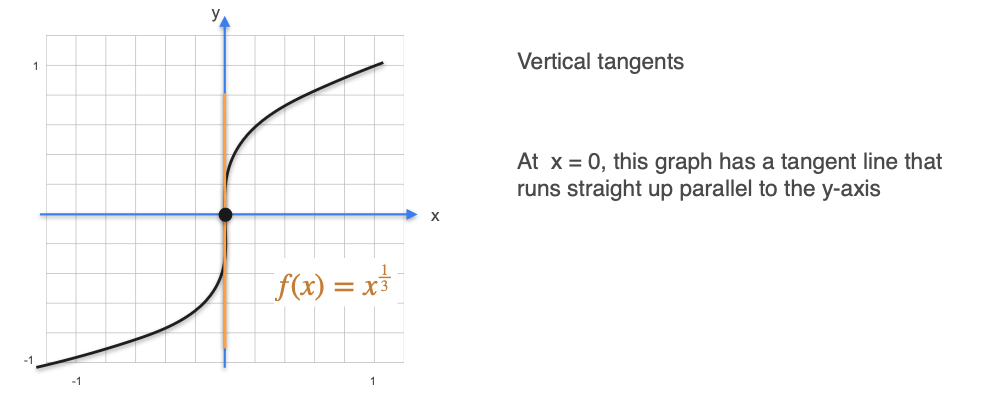

# Existence of the Derivative

In the previous lessons, we learned how to find the derivatives of several common functions. However, it's not always possible to find the derivative of a function at every single point. Functions where the derivative does not exist at certain points are called **non-differentiable** at those points.

Recall that the derivative at a point is the slope of the tangent line at that point. Therefore, a function is differentiable at a point if we can draw a **single, unique tangent line** at that point.

Let's explore the three common scenarios where this is not possible.

## 1. Corners or Cusps

A function is not differentiable at any point where its graph has a sharp corner or "cusp." The classic example is the **absolute value function**, $f(x) = |x|$.

The graph of $f(x) = |x|$ has a sharp corner at the origin (`x=0`). If you try to draw a tangent line at this point, it's not well-defined. An infinite number of lines could touch that single point, so there is no unique slope. Therefore, the derivative does not exist at `x=0`.

## 2. Discontinuities

A function must be **continuous** at a point to be differentiable there. If a function has a "jump" or a break (a discontinuity), you cannot define a single tangent line at that point.

If you have to lift your pencil to draw the graph, the function is not differentiable at the point where you lifted it.

## 3. Vertical Tangents

The third case is when the tangent line at a point is perfectly **vertical**.

A vertical line has an **undefined** slope (its "run" is zero, leading to division by zero). Since the derivative is the slope of the tangent line, the derivative is also undefined at that point. An example of this is the function $f(x) = x^{1/3}$ (the cube root of x).

---

**Next:** [Properties of the Derivative: Multiplication by Scalars](./15_constant_multiple_rule.md)