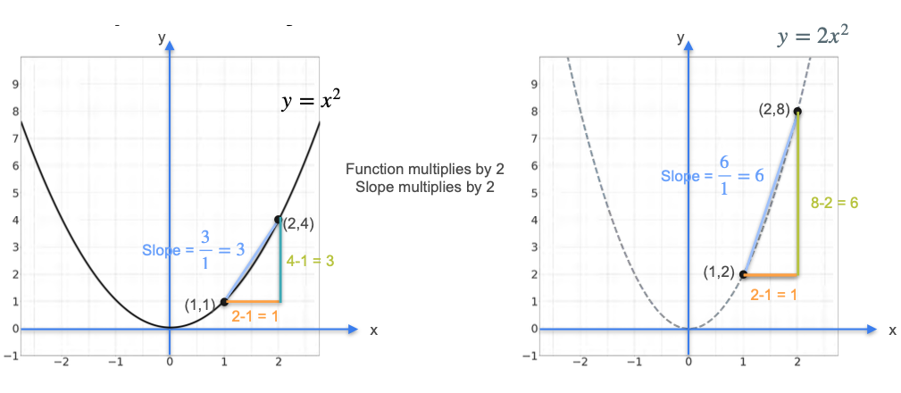

# Properties of the Derivative: Multiplication by Scalars

So far, we've learned the derivatives of some simple functions. To find the derivatives of more complicated functions, we can use a set of rules that build upon these simple cases.

The first and simplest rule is the **scalar (consant) multiple rule**.

**Rule:** The derivative of a constant `c` multiplied by a function `f(x)` is equal to the constant multiplied by the derivative of the function.

$$ \frac{d}{dx}[c \cdot f(x)] = c \cdot f'(x) $$

## The Geometric Intuition

Let's understand why this works. Consider the function $f(x) = x^2$ and a new function $g(x) = 2x^2$, which is just `f(x)` scaled by a factor of 2.

Multiplying the function by 2 has the effect of stretching the entire graph vertically by a factor of 2. Every y-value is doubled.

Let's look at the slope of a secant line on both graphs between `x=1` and `x=2`.

* **For $f(x) = x^2$:**
    * The run is $\Delta x = 2 - 1 = 1$.
    * The rise is $\Delta y = f(2) - f(1) = 4 - 1 = 3$.
    * The slope is $\frac{\Delta y}{\Delta x} = \frac{3}{1} = 3$.  

* **For $g(x) = 2x^2$:**
    * The run is still $\Delta x = 1$.
    * The rise is now $\Delta y = g(2) - g(1) = 8 - 2 = 6$. Notice the rise is exactly doubled.
    * The slope is $\frac{\Delta y}{\Delta x} = \frac{6}{1} = 6$.

Because we only stretched the graph vertically, the "rise" of any secant line is multiplied by our constant `c`, while the "run" stays the same. Therefore, the slope of the secant line is also multiplied by `c`.

As we take the limit and these secant lines become tangent lines, the same relationship holds. The slope of the tangent for the scaled function will be `c` times the slope of the tangent for the original function.

