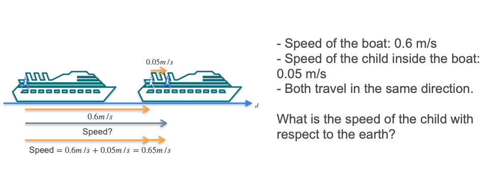
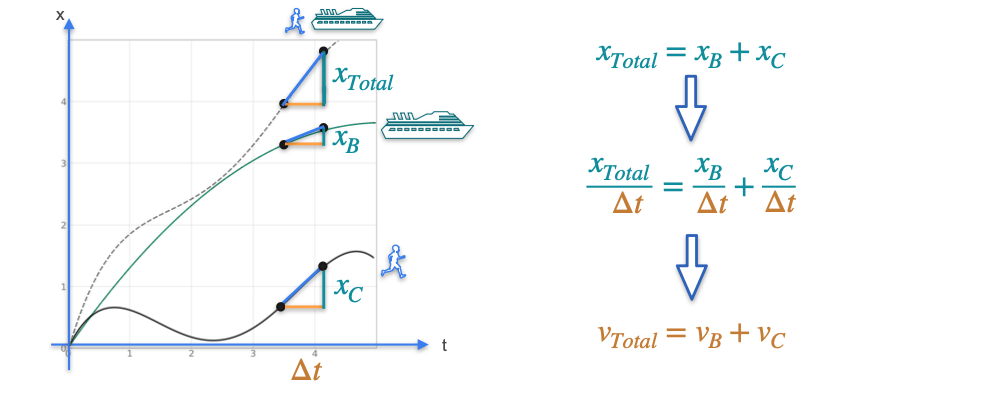

# Properties of the Derivative: The Sum Rule

Now that we know the scalar multiplication rule, the **sum rule** is just as simple and intuitive.

**Rule:** The derivative of a sum of two functions is the sum of their individual derivatives.

$$ \frac{d}{dx}[f(x) + g(x)] = f'(x) + g'(x) $$

## The Geometric Intuition: The Boat Analogy

Imagine a child running on the deck of a moving boat. The child's total movement with respect to the earth is the sum of the boat's movement and the child's own movement on the boat.

$$ \text{Distance}_{\text{total}} = \text{Distance}_{\text{boat}} + \text{Distance}_{\text{child}} $$

The sum rule tells us that the same logic applies to their velocities (their rates of change, or derivatives). The child's total velocity with respect to the earth is the sum of the boat's velocity and the child's velocity on the boat.

$$ \text{Velocity}_{\text{total}} = \text{Velocity}_{\text{boat}} + \text{Velocity}_{\text{child}} $$

If we plot the distance functions over time, the slope of the tangent line for the total distance will be the sum of the slopes of the other two tangent lines at any given point.

## Algebraic Intuition

We can see why this works by looking at the limit definition of the derivative. If $f(x) = g(x) + h(x)$, then the change in `f` is:

$$ \Delta f = f(x+\Delta x) - f(x) $$

$$ = (g(x+\Delta x) + h(x+\Delta x)) - (g(x) + h(x)) $$

Rearranging the terms:

$$ = (g(x+\Delta x) - g(x)) + (h(x+\Delta x) - h(x)) $$

$$ = \Delta g + \Delta h $$

Now, we divide everything by `Δx`:

$$ \frac{\Delta f}{\Delta x} = \frac{\Delta g}{\Delta x} + \frac{\Delta h}{\Delta x} $$

When we take the limit as `Δx` approaches zero, this equation becomes:

$$ f'(x) = g'(x) + h'(x) $$

This confirms that the derivative of the sum is the sum of the derivatives.

---

**Next:** [Properties of the Derivative: The Product Rule](./17_the_product_rule.md)