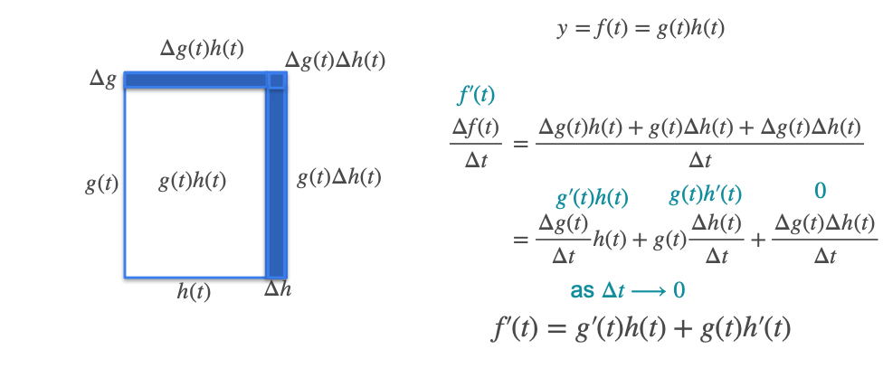

# Properties of the Derivative: The Product Rule

Now that we've learned the sum rule, we're ready for the **product rule**. It's a bit more complex, but follows a similar logic of breaking a problem down into parts.

If we have a function `f(x)` that is the product of two other functions, `g(x)` and `h(x)`, how do we find its derivative?

**The Product Rule:**

$$ f'(x) = g(x) \cdot h'(x) + g'(x) \cdot h(x) $$

In words: the derivative of a product is the **first function times the derivative of the second, plus the second function times the derivative of the first.**

## The Geometric Intuition: The Growing House

A great way to understand the product rule is to think about the area of a growing rectangular house.

* Let `g(t)` be the length of the side wall at time `t`.
* Let `h(t)` be the length of the front wall at time `t`.
* The total area of the house is `f(t) = g(t) · h(t)`.

We want to find `f'(t)`, which is the **rate of change of the area**.

Over a small time interval `Δt`, the walls grow by small amounts, `Δg` and `Δh`. The total change in area, `Δf`, is the sum of the three new blue rectangles shown in the diagram below.

## Algebraic Intuition

The total change in area (`Δf`) is the sum of the three new rectangles:

$$ \Delta f = (g \cdot \Delta h) + (\Delta g \cdot h) + (\Delta g \cdot \Delta h) $$

To find the rate of change, we divide everything by `Δt`:

$$ \frac{\Delta f}{\Delta t} = \frac{\Delta g}{\Delta t} \cdot h + g \cdot \frac{\Delta h}{\Delta t} + \frac{\Delta g \cdot \Delta h}{\Delta t} $$

Now, we take the limit as `Δt` approaches zero.

* $\frac{\Delta f}{\Delta t}$ becomes the derivative, $f'(t)$.  

* $\frac{\Delta g}{\Delta t}$ becomes $g'(t)$.  

* $\frac{\Delta h}{\Delta t}$ becomes $h'(t)$.

What about the last term, $\frac{\Delta g \cdot \Delta h}{\Delta t}$? As `Δt` goes to zero, both `Δg` and `Δh` also go to zero. This makes the term a product of two infinitesimally small numbers, so it becomes zero and drops out.

This leaves us with the final product rule:

$$ f'(t) = g'(t) \cdot h(t) + g(t) \cdot h'(t) $$

---

**Next:** [Properties of the Derivative: The Chain Rule](./18_the_chain_rule.md)