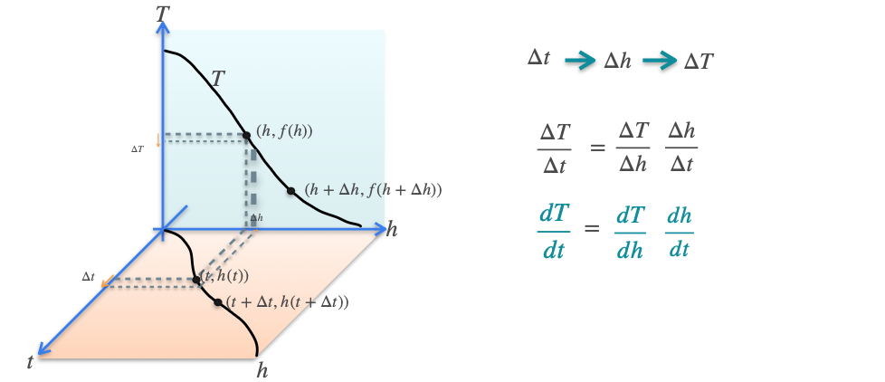

# Properties of the Derivative: The Chain Rule

Now that we know the sum and scalar rules, we are ready for the **chain rule**. It is the rule for finding the derivative of a **composition of functions**—when one function is applied to the output of another.

Let's say we have a function `h(t)`, and we apply another function `g` to its output, creating the composite function `g(h(t))`. The chain rule tells us how to find the derivative of this composition.

### Leibniz's Notation (The Intuitive Way)

This notation makes the rule look like simple fraction cancellation. If we have a variable `g` that depends on `h`, and `h` depends on `t`, then the rate of change of `g` with respect to `t` is:

$$ \frac{dg}{dt} = \frac{dg}{dh} \cdot \frac{dh}{dt} $$

### Lagrange's Notation (The Tricky Way)
In Lagrange's notation, it's important to remember *what* we plug into each function's derivative.

$$ (g(h(t)))' = g'(h(t)) \cdot h'(t) $$

The derivative of the "outside" function (`g'`) is evaluated at the value of the "inside" function (`h(t)`), and then multiplied by the derivative of the "inside" function (`h'`).

## An Analogy: Driving Up a Mountain

Imagine you are driving up a mountain.
* `t` = time
* `h` = height (altitude)
* `T` = temperature

As you drive, two things are happening simultaneously:
1.  Your height is changing with respect to time. The rate of this change is a derivative: **`dh/dt`** (your vertical speed).
2.  The temperature is changing with respect to your height (it gets colder as you go up). The rate of this change is **`dT/dh`**.

The question is: how fast is the temperature changing with respect to **time**? This is `dT/dt`.

The chain rule tells us that these rates are linked: the rate of change of temperature with respect to time is the product of the other two rates.

$$ \frac{dT}{dt} = \frac{dT}{dh} \cdot \frac{dh}{dt} $$

## Visualizing the Chain Rule

We can visualize this relationship in 3D. A small change in time (`Δt`) causes a change in height (`Δh`), which in turn causes a change in temperature (`ΔT`).

The chain rule shows how these small changes are connected in the limit.

---

**Next:** 