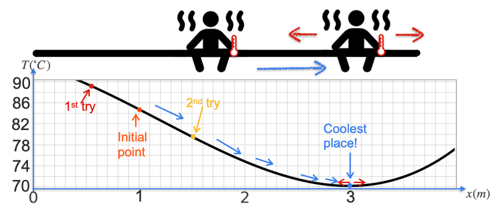
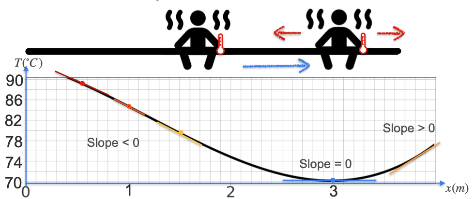
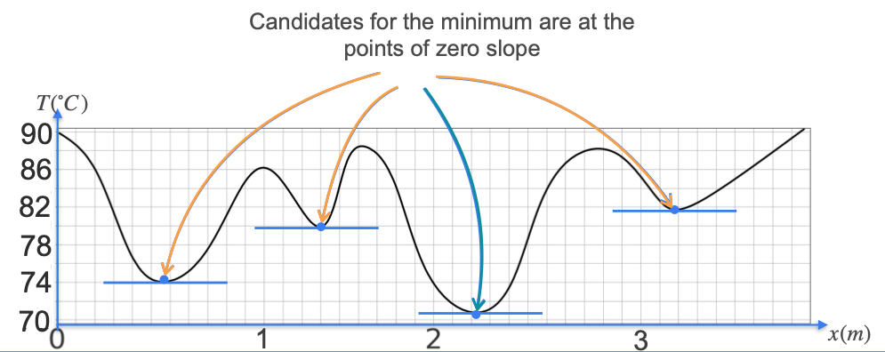

# Introduction to Optimization

Now that we have many tools for working with derivatives, we can explore one of their most important applications in machine learning: **optimization**.

Optimization is the process of finding the **minimum** or **maximum** value of a function. This is critical in machine learning because we often define an **error function** (or "cost function") that measures how poorly our model fits the data. The "best" model is the one that makes this error as small as possible. Therefore, training a machine learning model is an optimization problem: we want to **minimize the error function**.

## The Sauna Analogy

Imagine you are sitting on a long bench in a sauna, and you want to find the coolest spot. You have a thermometer to measure the temperature.

1.  You start at some point and measure the temperature: 85°C.
2.  You move a little to the left. The temperature is now 90°C. This is the wrong direction.
3.  You move to the right from your original spot. The temperature is 80°C. This is better, so you continue in this direction.
4.  You keep taking steps to the right, with the temperature dropping each time, until you reach a point where moving in *either* direction makes it hotter. You conclude you have found the coolest spot.

This iterative process of "trial and error" is the core idea behind optimization.

## The Connection to Derivatives

This search for a minimum has a direct connection to the derivative. Let's look at the slopes of the tangent lines along the temperature curve.

* In the region where moving right leads to a colder spot, the slope of the curve is **negative**.
* In the region where moving left leads to a colder spot, the slope is **positive**.
* At the exact coolest spot—the minimum—the curve flattens out, and the tangent line is horizontal. The slope at this point is **zero**.

This gives us the fundamental rule of optimization for differentiable functions:

**The candidates for a function's minimum or maximum values occur at the points where its derivative is equal to zero**.

## Local vs. Global Minima

It's important to note that a function can have multiple points where the derivative is zero. A more complex temperature curve might have several "dips."

Each of these points is a **local minimum**—it's the lowest point in its immediate neighborhood. The single lowest point across the entire function is called the **global minimum**.

When optimizing, finding a local minimum is often good, but the ultimate goal is to find the global minimum. For now, the key takeaway is that our search for the best solution can be narrowed down to just the points where the slope is zero.

