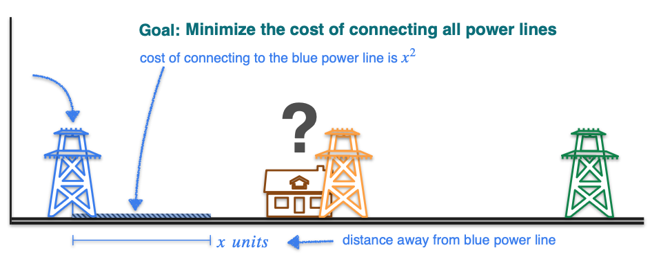
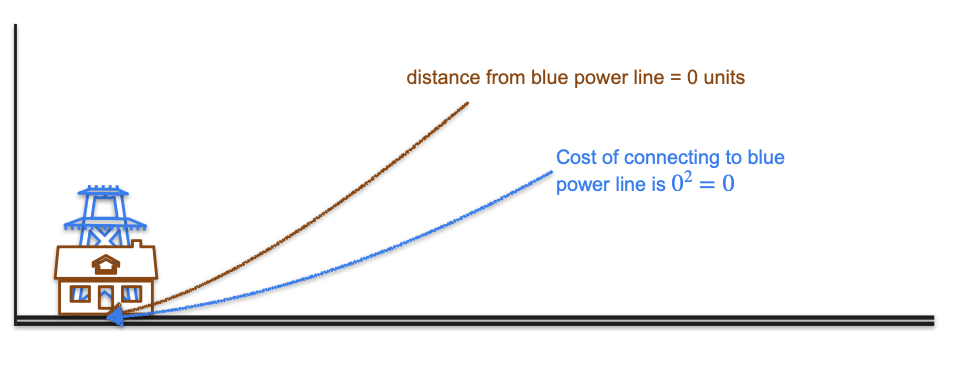
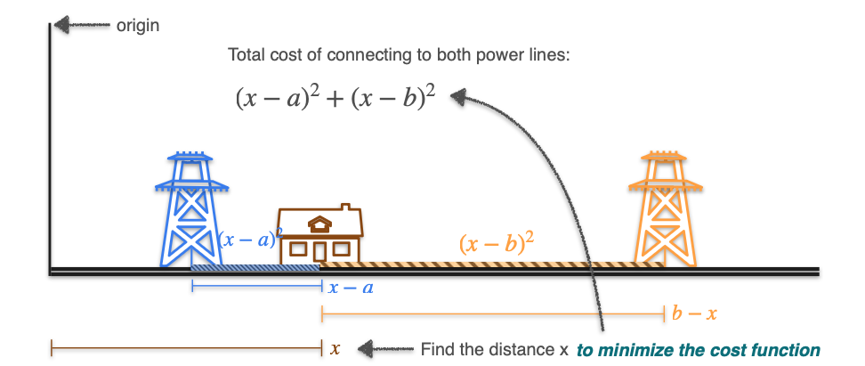
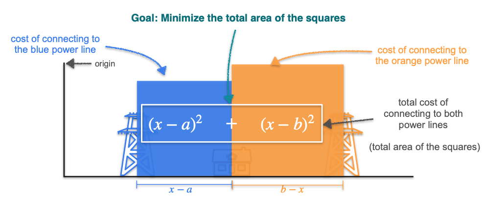
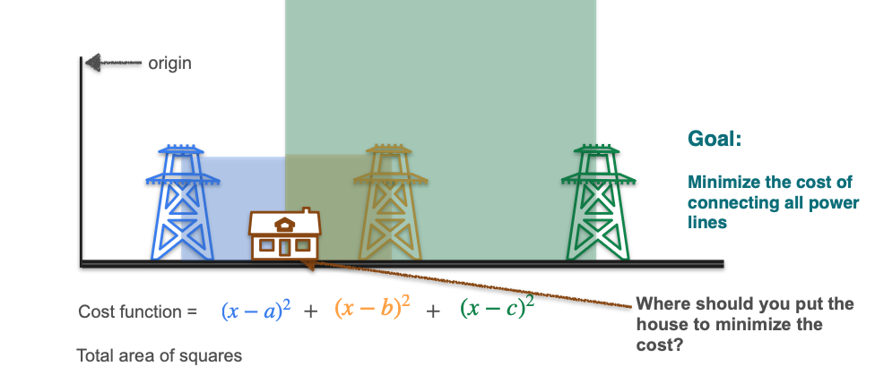
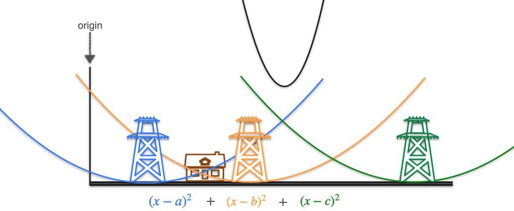

# Optimization of Squared Loss

Now we will see a more complex example of optimization. The problem involves finding the perfect location for a new house to minimize the cost of connecting it to several power lines.

This example is very important because the function we will minimize is a **squared error** function. Minimizing squared error is one of the most fundamental tasks in machine learning, used to train models like **linear regression** and many neural networks.

**The Problem:**
You need to build a house along a road and connect it to several power lines. The cost of connecting to any single power line is the **square of the distance** from your house to that power line.

$$ \text{Cost} = (\text{Distance})^2 $$

The goal is to find the location for the house that minimizes the *total* cost of connecting to *all* the power lines.

## The Simplest Case: One Power Line

Let's start with the simplest possible problem: there is only one power line. Where should you build your house to minimize the connection cost?

The answer is intuitive: you should build the house directly at the location of the power line.

* If the power line is at position `p`, and you build your house at position `x`, the distance is `(x - p)`.
* The cost is `Cost = (x - p)²`.
* To minimize this cost, you need to make the distance zero. This happens when `x = p`.
* The minimum possible cost is `0² = 0`.

This was a simple problem. Now, let's see what happens when we have more power lines.

## Two Powerlines

Now let's make the problem more interesting by adding a second power line.

* The first power line is at position `a`.
* The second power line is at position `b`.
* Our house is at an unknown position `x`.

The cost of connecting to each power line is the square of the distance.
* **Cost to line `a`:** $(x - a)^2$
* **Cost to line `b`:** $(x - b)^2$

The **total cost** is the sum of these two individual costs. This is our new cost function, which we want to minimize:

$$ \text{Cost}(x) = (x - a)^2 + (x - b)^2 $$

**Spoiler alert:** The solution is to place the house exactly in the middle of the two power lines. Let's use visualization and calculus to understand why.

### Visualizing the Cost

A great way to build intuition is to visualize the cost as the sum of the areas of two squares. The total area of the two squares represents the total cost. As we move the house's position `x`, the sizes of the squares change.

* If `x` is too close to `a`, the blue square is small, but the orange square becomes very large.
* If `x` is too close to `b`, the orange square is small, but the blue square becomes very large.

The optimal position `x` will be the one that makes the **sum of the two areas** as small as possible.

### Finding the Minimum with Calculus

The cost function is a quadratic ($x^2 - 2ax + a^2 + x^2 - 2bx + b^2 = 2x^2 - ...$), which is why its graph is a parabola. To find the minimum point of this parabola, we need to find where the slope of its tangent line is zero. In other words, we need to **take the derivative of the cost function and set it to zero.**

**Cost Function:**

$$ C(x) = (x - a)^2 + (x - b)^2 $$

**1. Find the derivative, C'(x):**
Using the sum rule and the chain rule:

$$ C'(x) = \frac{d}{dx}(x-a)^2 + \frac{d}{dx}(x-b)^2 $$

$$ C'(x) = 2(x-a) \cdot (1) + 2(x-b) \cdot (1) $$

$$ C'(x) = 2(x-a) + 2(x-b) $$

**2. Set the derivative to zero:**

$$ 2(x-a) + 2(x-b) = 0 $$

**3. Solve for x:**
* Divide both sides by 2: $(x-a) + (x-b) = 0$
* Combine terms: $2x - a - b = 0$
* Isolate x: $2x = a + b$ $\implies$ $x = \frac{a+b}{2}$

The optimal solution is to place the house at the **average** or **midpoint** of the two power lines.

## Three Powerlines

The problem now gets harder as we add a third power line.

* The power lines are at positions `a`, `b`, and `c`.
* Our house is at an unknown position `x`.

The **total cost** is the sum of the squares of the distances to all three power lines. This is the function we want to minimize:

$$ \text{Cost}(x) = (x - a)^2 + (x - b)^2 + (x - c)^2 $$

As you might guess, the solution is to place the house at the **average** (or mean) of the three power line locations. Let's see why.

### Visualizing the Cost

We can visualize this problem by thinking of each squared distance term as its own parabola. The total cost is then the sum of these three individual parabolas. The minimum of this new, combined parabola will be our optimal location.

### Finding the Minimum with Calculus

To find the minimum of our new cost function, we follow the same process: take the derivative and set it to zero.

**Cost Function:**

$$ C(x) = (x - a)^2 + (x - b)^2 + (x - c)^2 $$

**1. Find the derivative, C'(x):**
Using the sum rule and the chain rule on each term:

$$ C'(x) = 2(x-a) + 2(x-b) + 2(x-c) $$

**2. Set the derivative to zero:**

$$ 2(x-a) + 2(x-b) + 2(x-c) = 0 $$

**3. Solve for x:**
* Divide both sides by 2: $(x-a) + (x-b) + (x-c) = 0$
* Combine terms: $3x - a - b - c = 0$
* Isolate x: $3x = a + b + c$ $\implies$ $x = \frac{a+b+c}{3}$

The optimal solution is indeed the **average (mean)** of the locations of the three power lines.

## Generalizing to 'n' Power Lines (and Machine Learning)

This pattern can be generalized. If you have *n* power lines at locations $a_1, a_2, \dots, a_n$, the total cost function is:

$$ C(x) = \sum_{i=1}^{n} (x - a_i)^2 $$

The optimal location `x` that minimizes this cost will be the **mean** of all the locations:

$$ x = \frac{1}{n}\sum_{i=1}^{n} a_i $$

This "sum of squared errors" is one of the most important cost functions in machine learning. When we train a linear regression model, this is exactly the function the model is trying to minimize.