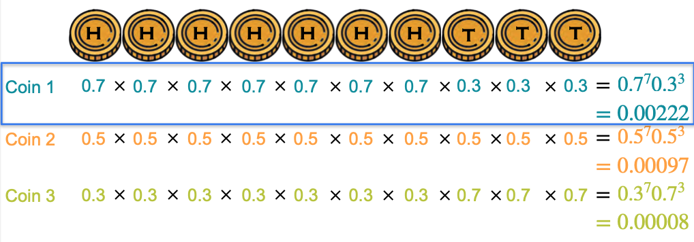
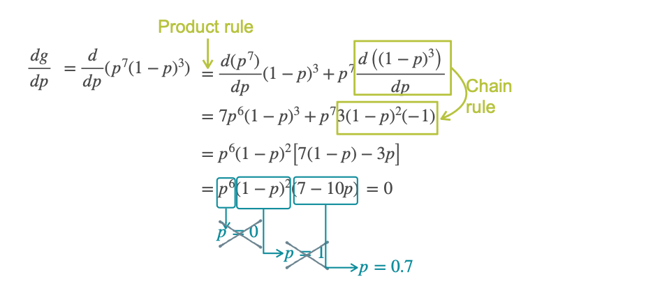

# Optimization of Log-Loss

In the previous lessons, our optimization example led to the **squared error** cost function, which is fundamental to regression. Now, we will explore another incredibly important function in machine learning called the **log-loss**, which is central to classification.

We will build our intuition for log-loss using a classic example from statistics: coin flips.

## The Biased Coin Game

Imagine a game where you toss a coin 10 times. You win a large prize only if you get a very specific sequence: **seven heads followed by three tails** (`HHHHHHHTTT`).

You get to choose the coin you use for the game, and you have three options, each with a different bias:

* **Coin 1:** 70% chance of Heads (p=0.7), 30% chance of Tails.
* **Coin 2:** 50% chance of Heads (p=0.5), 50% chance of Tails (a fair coin).
* **Coin 3:** 30% chance of Heads (p=0.3), 70% chance of Tails.

**Problem:** Which coin would you choose to maximize your chances of winning?

## Calculating the Probabilities

To pick the best coin, we need to calculate the probability of winning the game with each one. Since the coin flips are independent events, we can multiply their probabilities.

**For Coin 1 (p=0.7):**  
* Probability = $(0.7)^7 \times (0.3)^3 \approx 0.00222$

**For Coin 2 (p=0.5):**  
* Probability = $(0.5)^7 \times (0.5)^3 = (0.5)^{10} \approx 0.00098$

**For Coin 3 (p=0.3):**  
* Probability = $(0.3)^7 \times (0.7)^3 \approx 0.000075$

As we can see, **Coin 1** gives us the highest probability of winning.

## Finding the *Optimal* Coin with Calculus

But is a 70% bias the absolute best possible coin? Or could a 69% or 71% coin be even better? To find the perfect coin, we need to use calculus.

Let `p` be the unknown probability of getting heads. The probability of getting tails is then `1 - p`.

The probability of winning, as a function of `p`, is:

$$ g(p) = p^7 (1-p)^3 $$

Our goal is to find the value of `p` that **maximizes** this function. We do this by taking the derivative and setting it to zero.

As we see above, setting this to zero and solving for `p` is algebraically complex. This leads us to a much more elegant solution.

## The Logarithm Trick

A very common and powerful trick in machine learning is to optimize the **logarithm** of the probability instead of the probability itself. This is because the logarithm function is "monotonic"—if the probability `g(p)` is at its maximum, then `log(g(p))` will also be at its maximum. Maximizing one is the same as maximizing the other.

Let's define a new function, `G(p)`, as the natural logarithm of `g(p)`:

$$ G(p) = \ln(g(p)) = \ln(p^7 (1-p)^3) $$

Using the properties of logarithms, we can simplify this expression dramatically:
* $\ln(a \cdot b) = \ln(a) + \ln(b)$
* $\ln(a^k) = k \cdot \ln(a)$

Applying these rules, we get:

$$ G(p) = \ln(p^7) + \ln((1-p)^3) $$

$$ G(p) = 7\ln(p) + 3\ln(1-p) $$

This new function is much easier to differentiate.

## Optimizing the Log-Probability

Now, let's take the derivative of our simplified function `G(p)` and set it to zero.

$$ G'(p) = \frac{d}{dp}(7\ln(p) + 3\ln(1-p)) $$

Recall that the derivative of $\ln(x)$ is $1/x$. Using this and the chain rule:

$$ G'(p) = 7 \cdot \frac{1}{p} + 3 \cdot \frac{1}{1-p} \cdot (-1) $$

$$ G'(p) = \frac{7}{p} - \frac{3}{1-p} $$

Now, we set this derivative to zero to find the maximum:

$$ \frac{7}{p} - \frac{3}{1-p} = 0 $$

$$ \frac{7}{p} = \frac{3}{1-p} $$

$$ 7(1-p) = 3p $$

$$ 7 - 7p = 3p $$

$$ 7 = 10p $$

$$ p = 0.7 $$

Calculus confirms that the coin with a **70%** probability of heads is indeed the optimal coin.

## The Log-Loss Function

This function we optimized is directly related to the **log-loss** function. In machine learning, it's conventional to work with cost functions that we want to **minimize**. Because the logarithm of a probability (a number between 0 and 1) is always negative, we often work with the **negative log-probability**.

**The log-loss is the negative of the log-probability. Minimizing the log-loss is the same as maximizing the probability.**

This is a very useful cost function for classification problems.

## Maximum Likelihood
If we look closely, what we did was exactly machine learning. We found the best **model** to explain our **dataset**.

* **The Dataset:** The 10 coin flips (`HHHHHHHTTT`).
* **The Model:** A biased coin with an unknown probability `p` of landing on heads.

We found the model that most likely fits our dataset by maximizing the probability function. This process is called **Maximum Likelihood Estimation**.

## Two Reasons to Use Log-Loss

The question is, why did we use the logarithm of the probability? Why not just take the derivative of the original probability function? There are two critical reasons.

### Reason 1: Derivatives of Products are Hard

Our original probability function was a product:

$$ g(p) = p^7 (1-p)^3 $$

Taking the derivative of a product of two terms is manageable with the product rule. But what if our dataset was larger, for example, 6 heads and 4 tails, but in a mixed order like `HHTHTHHTTT`?

The probability function would be a much more complicated product:

$$ g(p) = p \cdot p \cdot (1-p) \cdot p \cdot (1-p) \cdot p \cdot p \cdot (1-p) \cdot (1-p) \cdot (1-p) $$

Taking the derivative of a product with 10 terms requires iterating the product rule, which becomes incredibly messy.

However, if we take the logarithm first, the product becomes a simple sum:

$$ G(p) = \ln(g(p)) = 6\ln(p) + 4\ln(1-p) $$

The derivative of this sum is trivial to calculate. While the result contains fractions (like `1/p`), this is a very small price to pay to avoid the complex derivative of a long product.

### Reason 2: Products of Tiny Numbers are a Computational Problem

Probabilities are numbers between 0 and 1. When you multiply many of them together, the result can become astronomically small.

Imagine we have a dataset with 1,000 data points. The total probability would be the product of 1,000 small numbers. The result might be a number so close to zero (e.g., $10^{-300}$) that a computer cannot store it accurately. This is called **numerical underflow**.

Logarithms solve this problem elegantly. The logarithm of a very small number is a large negative number, which computers can handle with high precision.

* `log(0.000000001)` = `-20.7`

By converting our probabilities to the log domain, we turn a multiplication of tiny numbers into a sum of manageable negative numbers, which prevents numerical errors.

**Key Takeaway:** Any time you encounter a problem in machine learning that involves a very complicated product (especially with probabilities), your first instinct should be to take the logarithm. It simplifies the math and improves numerical stability.