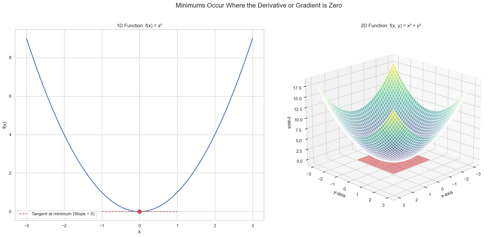

# Gradients and Maxima/Minima

The gradient is incredibly useful for finding the minimum or maximum of a function with multiple variables, just as the standard derivative was for functions of one variable.

Recall the 1D case: to find the minimum of a function like $f(x) = x^2$, we find the point where the slope of the tangent line is zero.

For a function of multiple variables, the same principle applies. At a local minimum or maximum, the **tangent plane** will be perfectly horizontal. A horizontal plane has a slope of zero in *every* direction. This means that both the partial derivative with respect to `x` and the partial derivative with respect to `y` must be zero at that point.

In other words, to find the minimum or maximum of a multivariable function, we need to find the point where the **gradient is the zero vector**.

## Finding the Minimum Algebraically

Let's compare the process for both cases.

### The 1D Case
To find the minimum of $f(x) = x^2$, we set its derivative to zero.
* **Derivative:** $f'(x) = 2x$
* **Set to zero:** $2x = 0$
* **Solution:** $x = 0$

### The 2D Case
To find the minimum of $f(x, y) = x^2 + y^2$, we set its **gradient** to the zero vector. The gradient is the vector of partial derivatives.

1.  **Find the partial derivatives:**
    * $\frac{\partial f}{\partial x} = 2x$  

    * $\frac{\partial f}{\partial y} = 2y$

2.  **Form the gradient vector:**

$$ \nabla f = \begin{bmatrix} 2x \\ 
2y \end{bmatrix} $$

3.  **Set the gradient to the zero vector:**

$$ \begin{bmatrix} 2x \\ 
2y \end{bmatrix} = \begin{bmatrix} 0 \\ 
0 \end{bmatrix} $$

4.  **Solve the resulting system of equations:**
    * $2x = 0 \implies x = 0$
    * $2y = 0 \implies y = 0$

The solution is the point `(x, y) = (0, 0)`, which is the minimum of the function.

**For any differentiable function of multiple variables, the candidates for its minima and maxima are the points where all of its partial derivatives are simultaneously zero.**