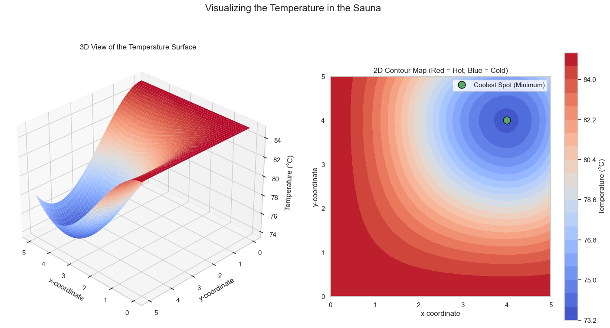

# Optimization with Gradients: An Example

In the previous lesson, we saw how to find the minimum of a function in one dimension. Now, let's extend that to a more realistic, two-dimensional problem.

### The 2D Sauna Problem
Imagine you are standing in a 5x5 meter sauna. You are starting to feel hot and want to find the coolest spot in the room. The temperature is not uniform; it varies based on your `(x, y)` coordinates.

The temperature in the room can be described by a 3D surface, where the height represents the temperature at each point. Our goal is to find the coordinates of the lowest point on this surface.

## Finding the Minimum

As we learned with one-variable functions, the minimum of a function occurs where its derivative is zero. For a function of two variables, this means the **tangent plane** is horizontal, which happens when **both partial derivatives are simultaneously zero**.

In other words, we need to find the point `(x, y)` where the gradient is the zero vector:

$$ \nabla T(x, y) = \begin{bmatrix} \frac{\partial T}{\partial x} \\ 
\frac{\partial T}{\partial y} \end{bmatrix} = \begin{bmatrix} 0 \\ 
 0 \end{bmatrix} $$

**The Temperature Function:**

$$ T(x, y) = 85 - \frac{1}{90}(x^3 - 6x^2)(y^3 - 6y^2) $$

### Step 1: Find the Partial Derivatives
After applying the product rule and simplifying, we get the partial derivatives:

$$ 
\frac{\partial T}{\partial x} = -\frac{1}{90} (3x^2 - 12x)(y^3 - 6y^2) = -\frac{1}{90} (3x(x-4))(y^2(y-6)) 
$$  

$$ 
\frac{\partial T}{\partial y} = -\frac{1}{90} (x^3 - 6x^2)(3y^2 - 12y) = -\frac{1}{90} (x^2(x-6))(3y(y-4)) 
$$

### Step 2: Set Both Derivatives to Zero
We need to find the `(x, y)` pairs that solve this system of equations:

1.  $-\frac{1}{90} (3x(x-4))(y^2(y-6)) = 0$  

2.  $-\frac{1}{90} (x^2(x-6))(3y(y-4)) = 0$

For the first equation to be zero, one of its factors must be zero. This gives us potential solutions:
* `x = 0`
* `x = 4`
* `y = 0`
* `y = 6`

For the second equation to be zero, one of its factors must be zero:
* `x = 0`
* `x = 6`
* `y = 0`
* `y = 4`

### Step 3: Find the Common Solutions
We need the points `(x, y)` that satisfy **both** equations. By checking the possible combinations, we find the "critical points" where the gradient is zero: `(0,0)`, `(0,4)`, `(0,6)`, `(4,0)`, `(4,4)`, `(6,0)`, `(6,4)`, and `(6,6)`.

### Step 4: Evaluate the Candidates
Finally, we evaluate the temperature function at each of these candidate points (within our 5x5 sauna) to find which one is the true minimum.

* **T(0, 0) = 85°C** (Maximum)
* **T(0, 4) = 85°C** (Maximum)
* **T(4, 0) = 85°C** (Maximum)
* **T(4, 4) = 73.6°C** (Minimum)

The calculus confirms that the coolest spot in the sauna is at the coordinates **(4, 4)**.