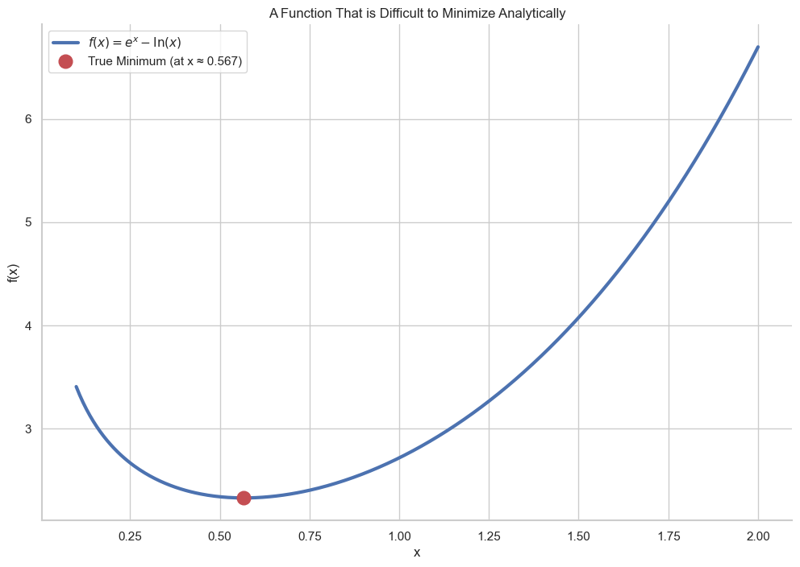
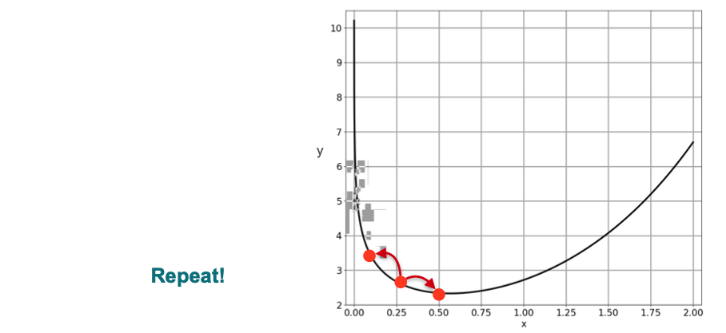

# The Need for Gradient Descent

So far, we've learned how to solve optimization problems by taking the derivative, setting it to zero, and solving for `x` analytically. However, this method can get very complicated, very fast.

Consider the function:

$$ f(x) = e^x - \ln(x) $$

To find its minimum, we would need to solve the equation $f'(x) = 0$:

$$ e^x - \frac{1}{x} = 0 \implies e^x = \frac{1}{x} $$

Solving this equation for `x` is extremely difficult to do by hand. This is a common problem in machine learning, where our cost functions are often too complex to solve analytically.

This motivates the need for an **iterative** method that can find the minimum of a function in a step-by-step way, even if we can't solve for it directly. This method is called **Gradient Descent**. Let's start with a simple, intuitive version of this iterative approach.

## A Simple Iterative Approach

Since we can't solve for the minimum directly, let's try to find it with a simple "guess and check" method.

1.  **Start** at a random point on the curve.
2.  **Explore:** Take a small step to the left and a small step to the right.
3.  **Decide:** Check the function's value at both new points. Move to the point that has the lower value (since we're minimizing).
4.  **Repeat:** Continue this process from the new point.

Eventually, we will reach a point where taking a step in either direction results in a *higher* value. At this stage, we can conclude that we are at (or very close to) a local minimum and stop.

This method is not bad, but it's inefficient. We have to check two directions at every step. There is a much more powerful way to know the best direction to move in, which we will explore in the next lesson.