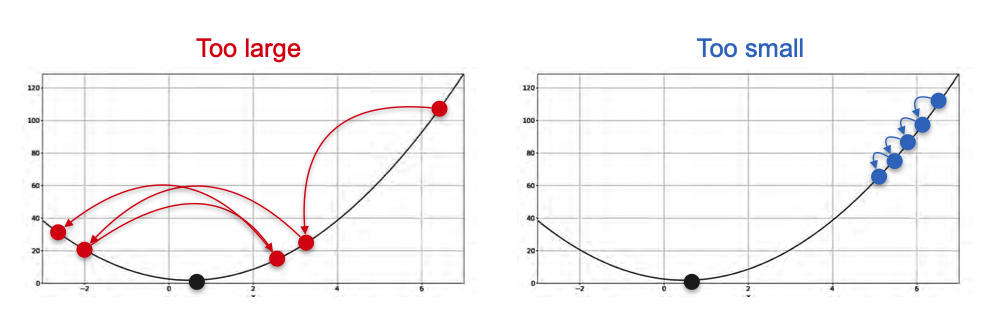
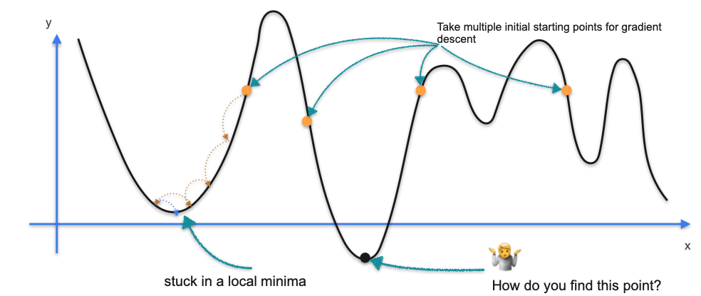

# Drawbacks of Gradient Descent

While Gradient Descent is a powerful and fundamental optimization algorithm, it's not without its challenges. Successfully using it requires navigating two key problems: choosing an appropriate learning rate and dealing with the possibility of local minima.

## Challenge 1: The Difficulty of Finding the Optimal Learning Rate

The **learning rate (`α`)** is a hyperparameter that controls the size of the steps the algorithm takes at each iteration. Finding a good learning rate is a "Goldilocks" problem: it must be "just right."

* **If the learning rate is too large:** The steps can be too big, causing the algorithm to overshoot the minimum and bounce around chaotically, never finding the best solution.
* **If the learning rate is too small:** The steps will be tiny and inefficient. It might take an extremely long time to reach the minimum, or the process might stop before it gets there.

Finding a good learning rate is a well-known research problem, and while there are advanced methods to adapt it during training, there is no single definitive way to find the perfect value.

## Challenge 2: The Danger of Local Minima

Gradient Descent is designed to find the bottom of the "valley" it starts in. However, some functions have many valleys.

If we start our algorithm in the wrong place, it might confidently walk to the bottom of a small, nearby valley and get stuck there, without ever realizing there is a much deeper valley (the true minimum) somewhere else.

* **Local Minimum:** A point that is lower than its immediate neighbors, but not the lowest point overall.
* **Global Minimum:** The single lowest point across the entire function.

**How do we overcome this?**
There is no guaranteed way to find the global minimum. However, a common and effective strategy is to **run the gradient descent algorithm multiple times from many different random starting points.** The hope is that at least one of these starting points will be in the "valley" that contains the global minimum.

---

**Next:** [Optimization using Gradient Descent in Two Variables](./04_gradient_descent_in_two_variables.md)