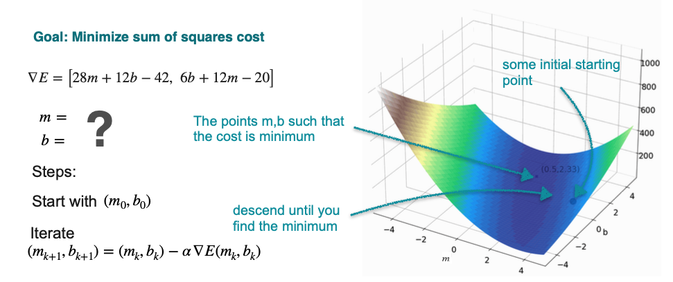

# Gradient Descent on a 2D Cost Function

In the previous lesson, we solved the 2D power line problem by finding an exact, **analytical solution**. We took the partial derivatives of the cost function, set them to zero, and solved a system of linear equations to find the optimal slope `m` and intercept `b`.

While this works for simple problems, it becomes very difficult for models with many features. Now, we will solve the **exact same problem** using an iterative method: **Gradient Descent**.

**The Problem Recap:**

Find the line `y = mx + b` that minimizes the total cost (sum of squared vertical distances) for the three power line locations: (1, 2), (2, 5), and (3, 3).

**The Cost Function (E):**

$$ E(m, b) = 14m^2 + 3b^2 + 38 + 12mb - 42m - 20b $$

**The Gradient (∇E):**

The gradient of our cost function is the vector of its two partial derivatives:

$$ \nabla E(m, b) = \begin{bmatrix} \frac{\partial E}{\partial m} \\ 
\frac{\partial E}{\partial b} \end{bmatrix} = \begin{bmatrix} 28m + 12b - 42 \\ 
12m + 6b - 20 \end{bmatrix} $$

Our goal is to use this gradient to iteratively "walk" from a random starting point `(m₀, b₀)` down to the point where the cost `E` is at its minimum.

## The Gradient Descent Algorithm

The process is exactly the same as in the one-variable case, just applied to vectors.

1.  **Start** with a random point `(m₀, b₀)`.
2.  **Calculate the gradient vector** `∇E` at the current point.
3.  **Update the point** by taking a small step in the opposite direction of the gradient:

$$ \begin{bmatrix} m_{new} \\ b_{new} \end{bmatrix} = \begin{bmatrix} m_{old} \\ b_{old} \end{bmatrix} - \alpha \cdot \nabla E(m_{old}, b_{old}) $$

4.  **Repeat** for many iterations.

As you can see in the plot, the algorithm iteratively "walks" down the hill of the cost surface and converges to the same optimal solution we found analytically: `m = 0.5` and `b ≈ 2.33`.

This iterative approach is far more scalable and is the standard method used to train most machine learning models, including very complex ones like neural networks.