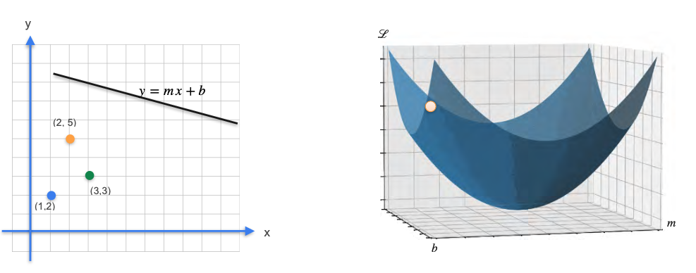
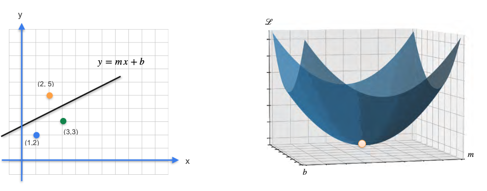
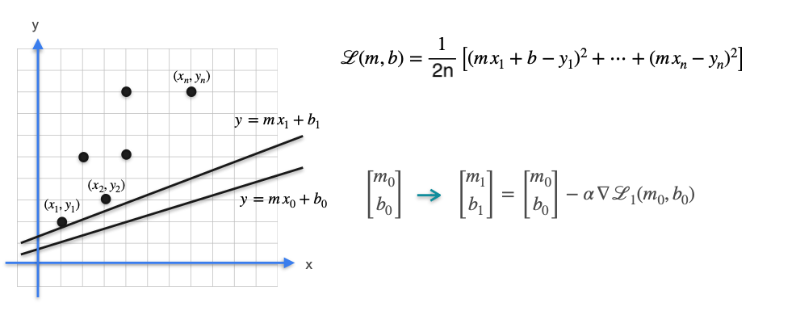
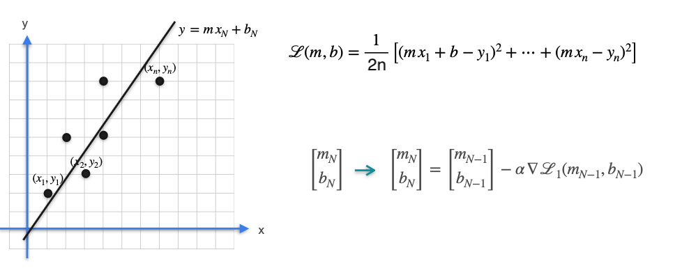

# Gradient Descent for Multiple Observations

In the previous lesson, we used Gradient Descent to find the optimal slope (`m`) and intercept (`b`) that minimized our cost function. The key idea was visualizing the cost as a 3D surface and "walking" to the bottom.

Let's make this connection more explicit. Every possible line `y = mx + b` that we can draw through our data corresponds to a single point `(m, b)` in a "parameter space." The cost (or error) of that line is the "height" above that point.

* A **bad line** that is far from the data points has a **high cost** and corresponds to a **high point** on the cost surface.
* The **best-fit line** has the **lowest cost** and corresponds to the **lowest point** (the minimum) on the cost surface.

The process of fitting a line is the same as finding the minimum on this surface. Gradient Descent is the algorithm that takes us from a random, bad line to the best-fit line by iteratively walking down the cost surface.

## The General Case: Linear Regression

Let's apply this to a more general problem. Imagine you have a dataset with *n* observations of TV advertising budget (`x`) and the corresponding product sales (`y`). The goal is to find the line of best fit.

The cost for a single data point $(x_i, y_i)$ is the squared vertical distance to the line:

$$ \text{Error}_i = (y_i - (mx_i + b))^2 $$

To get the total cost for the entire dataset, we take the **average** of the errors for all *n* points. This function is called the **Mean Squared Error (MSE)** and is the standard cost function for linear regression.

$$ L(m, b) = \frac{1}{n}\sum_{i=1}^{n} (y_i - (mx_i + b))^2 $$

> _Note: You will often see two variations of this formula in textbooks and tutorials:_
>
> _1.  ***Using `1/(2n)` instead of `1/n`***: The extra `2` in the denominator is a common mathematical convenience. When we take the derivative of the cost function, the Power Rule brings down the exponent `2` from the squared term. This `2` then perfectly cancels out with the `1/2` at the front, which makes the final derivative formula cleaner and simpler to work with. This scaling does not change the location of the minimum, so both formulas lead to the same final model._
> 
> _2.  ***Order of Subtraction***: The term inside the square is sometimes written as `(mxᵢ + b - yᵢ)` instead of `(yᵢ - (mxᵢ + b))`. This makes no difference to the final result because the difference is squared. Since `(5)²` and `(-5)²` are both `25`, the order of subtraction does not affect the calculated cost._

## The Gradient Descent Algorithm for Linear Regression

1.  **Start** with a random line (i.e., choose random initial values for `m` and `b`).
2.  **Iterate:**
    * Calculate the gradient of the loss function `L(m, b)`.
    * Update `m` and `b` by taking a small step in the opposite direction of the gradient.
    * This update results in a new, slightly better line.
3.  **Repeat** for many iterations until the line converges to the best possible fit.

---

**Next:** [Regression with a Perceptron: Introduction](../05_optimization_in_neural_networks/01_regression_with_a_perceptron--introduction.md)