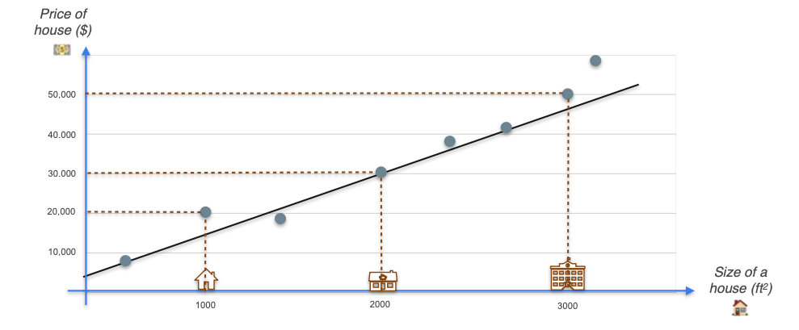
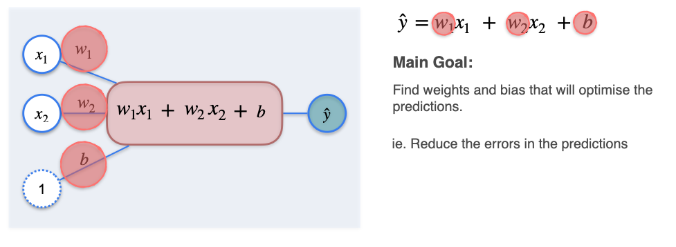

# Regression with a Perceptron: Introduction

In this module, you're going to learn what a neural network is and how to train one using gradient descent. The fundamental unit of a neural network is the **perceptron**. This may sound like a new concept, but you've already seen one, because **linear regression** can be expressed as a perceptron.

Let's use one of the most classic examples in linear regression: predicting the price of a house.

We start with a dataset. For each house, we have a feature (its size) and a target (its price).
* **Feature:** `size_sqft`
* **Target:** `price_usd`

If we plot this data, we might see a linear trend. The goal of linear regression is to find the "line of best fit" that captures this trend and allows us to predict the price for a new house given its size.

## From One Feature to Many: The Perceptron Model

In the real world, the price of a house depends on more than just its size. Let's add a second feature: the **number of rooms**.

How can we combine both `size` and `rooms` to make a better prediction? A simple line is no longer enough. We need a more general model that can handle any number of inputs. This is the **perceptron**.

A perceptron is the simplest possible neural network. It's a model designed to take multiple inputs, combine them, and produce a single output.

Let's break down how it works step-by-step:

* **Inputs (Features):** These are the known characteristics of our house. 
    * $x_1$: size_sqft  

    * $x_2$: number_of_rooms  

* **Weights (Parameters):** Each input feature is multiplied by a corresponding **weight**. The weight represents the importance of that feature. A feature that has a large impact on the price will learn a large weight.
    * $w_1$: weight for size  

    * $w_2$: weight for rooms

* **Bias (Parameter):** A constant value, `b`, is also added. The bias represents a baseline price and allows the model to fit data that doesn't pass through the origin. For example, a house has some base value even if its size and room count were zero.

* **Summation:** The perceptron calculates the **weighted sum** of the inputs and adds the bias.

The final output, $\hat{y}$ (our predicted price), is given by the familiar linear equation:

$$ \hat{y} = w_1x_1 + w_2x_2 + b $$

This equation describes a **plane** in 3D space, which is the higher-dimensional equivalent of our 2D line of best fit. The "learning" task for this model is to find the optimal values for the **parameters**—the weights ($w_1, w_2$) and the bias (`b`)—that make our predictions as close as possible to the actual prices for every house in our dataset.

To do this, we first need a way to measure the total "error" of our model. This is the job of a **loss function**, which we will explore next.

---

**Next:** [Regression with a Perceptron: The Loss Function](./02_regression_with_a_perceptron--the_loss_function.md)
