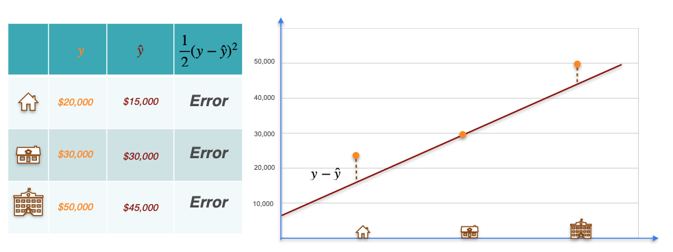
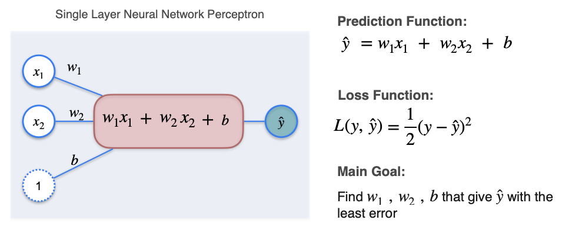

# Regression with a Perceptron: The Loss Function

In the previous lesson, we saw how a perceptron can represent a linear regression model. The model is the line itself, defined by its weights (`w`) and bias (`b`).

The key question is: **How do we find the *best possible* line?**

To do this, we need a way to mathematically evaluate how well our line is doing. We need to quantify how far our model's predictions are from the actual values. This is the job of a **loss function**.

### The Error (or Residual)
For any single data point, the **error** (also called the residual) is the vertical distance between the actual value (`y`) and the value our line predicted (`ŷ`).

$$ \text{Error}_i = y_i - \hat{y}_i $$

Some of these errors will be positive (if the point is above the line) and some will be negative (if the point is below the line). If we just added them up, they might cancel each other out, giving us a misleadingly small total error.

### The Squared Error
To solve this, we **square** each individual error. This has two benefits:
1.  All errors become positive.
2.  It penalizes larger errors much more heavily than smaller ones.

The standard loss function for linear regression is the **Mean Squared Error (MSE)**. For now, we will look at the loss for a single point, often written as:

$$ L(y, \hat{y}) = \frac{1}{2}(y - \hat{y})^2 $$

*(Note: The `1/2` is a mathematical convenience that makes the derivative cleaner. It doesn't change the location of the minimum.)*

Our ultimate goal is to find the weights `w` and bias `b` that **minimize** the sum of this loss function across all the data points in our dataset. We will achieve this using **Gradient Descent**.

---

**Next:** [Regression with a Perceptron: Gradient Descent](./03_regression_with_a_perceptron--gradient_descent.md)
