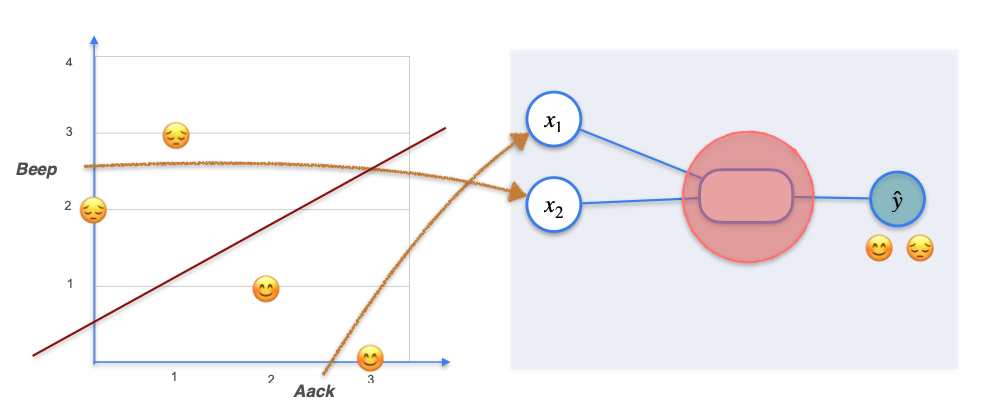
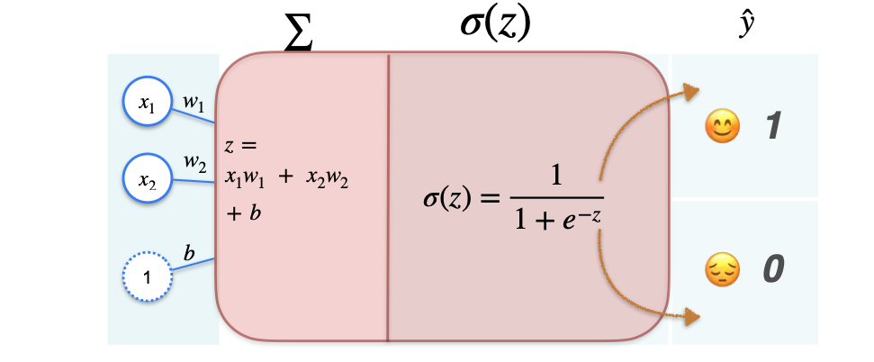

# Classification with a Perceptron: Introduction

You've already seen how perceptrons can be used for **linear regression problems** to predict continuous values (like house prices). However, perceptrons are also fundamental to **classification problems**, where the goal is to predict discrete categories (like "happy" or "sad").

The key to adapting a perceptron for classification is the addition of an **activation function**.

Let's revisit an example you've seen before: determining the mood of alien sentences.
Imagine we have collected four sentences from an alien civilization, and we've observed the mood of the alien when they spoke each one:

* Sentence 1: Happy
* Sentence 2: Sad
* Sentence 3: Sad
* Sentence 4: Happy

To use this data in a model, we first need to convert the words into numbers. We'll count the occurrences of two key words: "aack" ($x_1$) and "beep" ($x_2$).

| Sentence | Aack ($x_1$) | Beep ($x_2$) | Mood (Target `y`) |
| :------- | :----------- | :----------- | :---------------- |
| 1        | 3            | 0            | Happy (1)         |
| 2        | 0            | 2            | Sad (0)           |
| 3        | 1            | 3            | Sad (0)           |
| 4        | 2            | 1            | Happy (1)         |

*(Note: We've assigned 'Happy' to 1 and 'Sad' to 0, which is common for binary classification.)*

If we plot these points, we might see a pattern:

As you can see, the happy sentences tend to be on the bottom-right, and the sad sentences on the top-left. Our model's job is to find a way to separate these two categories.

## The Classification Perceptron

The core structure of a classification perceptron is very similar to the regression perceptron, but with one crucial addition.

Let's review its components:

* **Inputs ($x_1, x_2$):** The numerical features (word counts).
* **Weights ($w_1, w_2$):** Determine the importance of each word for predicting mood.
    * If 'aack' correlates with happiness, $w_1$ will be positive.
    * If 'beep' correlates with sadness, $w_2$ will be negative.
* **Bias ($b$):** A constant term that helps shift the decision boundary.

**The Summation (z):**
Just like in regression, we first calculate a weighted sum of inputs plus the bias:

$$ z = w_1x_1 + w_2x_2 + b $$

This value, `z`, can be any continuous number, from very negative to very positive.

**The Problem:** For classification, we don't want a continuous number as an output. We want a probability or a clear category (0 or 1). How do we turn a continuous number `z` into something that represents a probability between 0 and 1?

**The Solution: The Activation Function**
This is where the **activation function** comes in. For binary classification, a very common choice is the **sigmoid function**.

The sigmoid function takes any real-valued number (`z`) and "squashes" it into a value between 0 and 1.

$$ \hat{y} = \sigma(z) = \frac{1}{1 + e^{-z}} $$

* If `z` is a large positive number, $\hat{y}$ will be close to 1.
* If `z` is a large negative number, $\hat{y}$ will be close to 0.
* If `z` is 0, $\hat{y}$ will be 0.5.

**Interpreting the Output ($\hat{y}$):**
The output $\hat{y}$ can be interpreted as the **probability** that the sentence belongs to the "happy" class (class 1).
* $\hat{y} = 0.9$: Model is confident it's happy.
* $\hat{y} = 0.1$: Model is confident it's sad.
* $\hat{y} = 0.5$: Model is uncertain (on the decision boundary).

In the next section, we will delve deeper into the properties of the sigmoid function. For now, understand that it's the critical component that transforms the continuous output of the linear combination into a probability for classification.

---

**Next:** [Classification with a Perceptron: The Sigmoid Function](./05_classification_with_a_perceptron--sigmoid_function.md)
