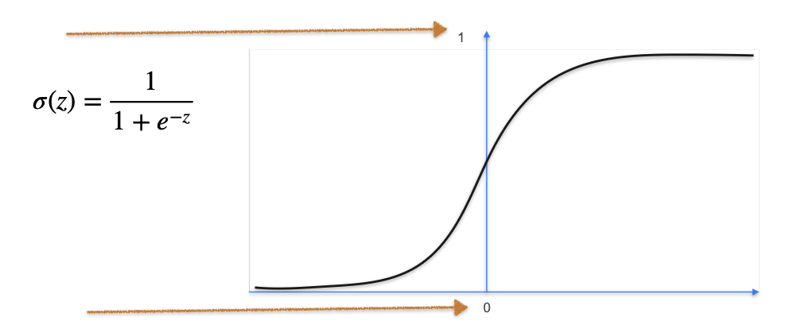

# Classification with a Perceptron: The Sigmoid Function

In the previous lesson, we learned that to turn a regression perceptron into a classification perceptron, we need to add an **activation function**. The job of this function is to take the continuous output of the summation step (`z`) and convert it into a value that represents a probability, typically between 0 and 1.

The most common activation function for binary classification is the **sigmoid function**.

**Formula:**
The sigmoid function, denoted as $\sigma(z)$, is defined by the formula:

$$ \sigma(z) = \frac{1}{1 + e^{-z}} $$

**Key Property:**
The sigmoid function takes the entire number line as its input and "squashes" it into the interval `(0, 1)`.
* If `z` is a large positive number, $e^{-z}$ is very close to 0, so $\sigma(z)$ is close to 1.
* If `z` is a large negative number, $e^{-z}$ is very large, so $\sigma(z)$ is close to 0.
* If `z` is exactly 0, $\sigma(0) = \frac{1}{1+e^0} = \frac{1}{1+1} = \frac{1}{2}$.

This property is perfect for classification, as the output can be interpreted as a probability.

## The Derivative of the Sigmoid Function

Another reason the sigmoid function is so popular in machine learning is that its derivative is very simple to calculate and has an elegant form. This is crucial for training neural networks using gradient descent, as it makes the calculations much more efficient.

Let's find the derivative, $\sigma'(z)$.

1.  **Rewrite the function** using a negative exponent:

$$ \sigma(z) = (1 + e^{-z})^{-1} $$

2.  **Apply the chain rule:** The derivative of $(\text{something})^{-1}$ is $-1 \cdot (\text{something})^{-2}$, multiplied by the derivative of the "something."

$$ \sigma'(z) = -1 \cdot (1 + e^{-z})^{-2} \cdot \frac{d}{dz}(1 + e^{-z}) $$

3.  **Calculate the inner derivative:** The derivative of $1$ is $0$, and the derivative of $e^{-z}$ is $e^{-z} \cdot (-1)$.

$$ \sigma'(z) = -(1 + e^{-z})^{-2} \cdot (-e^{-z}) $$

4.  **Simplify:** The two negative signs cancel out.

$$ \sigma'(z) = \frac{e^{-z}}{(1 + e^{-z})^2} $$

5.  **A clever algebraic trick:** We can rewrite the numerator by adding and subtracting 1: $e^{-z} = (1 + e^{-z}) - 1$.

$$ \sigma'(z) = \frac{(1 + e^{-z}) - 1}{(1 + e^{-z})^2} $$

6.  **Split the fraction:**

$$ \sigma'(z) = \frac{1 + e^{-z}}{(1 + e^{-z})^2} - \frac{1}{(1 + e^{-z})^2} $$

$$ = \frac{1}{1 + e^{-z}} - \left(\frac{1}{1 + e^{-z}}\right)^2 $$

7.  **Recognize the sigmoid function:** The term $\frac{1}{1 + e^{-z}}$ is just our original sigmoid function, $\sigma(z)$.

$$ \sigma'(z) = \sigma(z) - (\sigma(z))^2 $$

#### The Final Rule:
$$ \sigma'(z) = \sigma(z) \cdot (1 - \sigma(z)) $$

This beautiful result means that the derivative of the sigmoid at a point `z` can be calculated directly from its **output value**, without needing to refer back to `z` or calculate any more exponentials. This makes the backpropagation algorithm in neural networks much faster.

---

**Next:** [Classification with a Perceptron: Gradient Descent](./06_classification_with_a_perceptron--gradient_descent.md)
